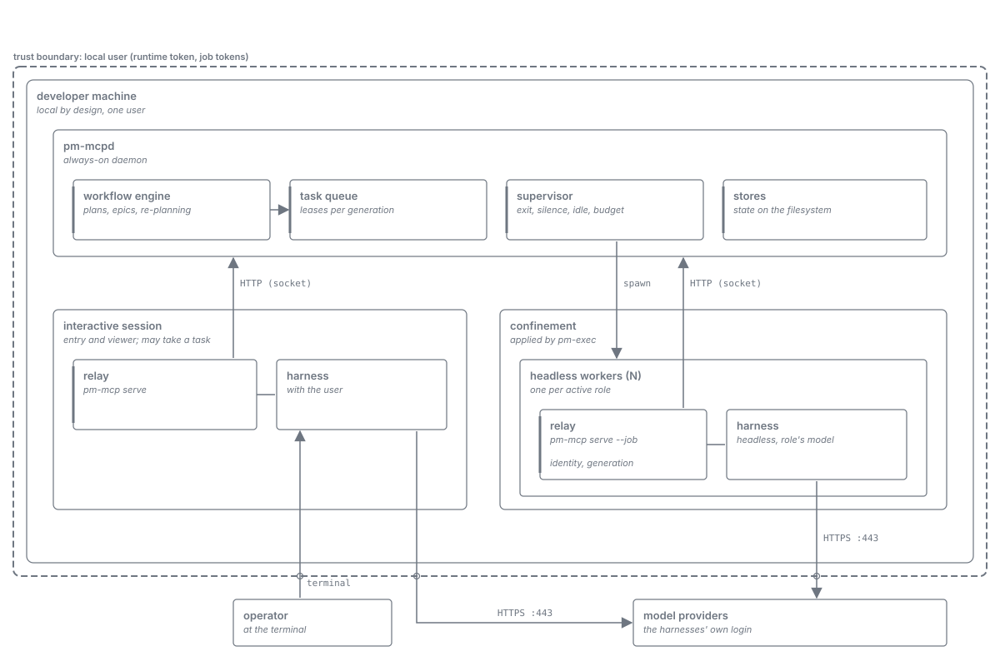

= Harness as Worker: Architecture
:toc: left
:toclevels: 2
:nofooter:

xref:../../Concepts.adoc[Concepts] » xref:README.adoc[Harness as Worker] » Architecture

xref:README.adoc[Overview] · xref:journey.adoc[Journey] · *Architecture* · xref:task-protocol.adoc[Task Protocol] · xref:roles.adoc[Roles] · xref:skills.adoc[Skills]

`PM-MCP` drives plans and epics. Harness processes are its workers: the server starts them, offers them tasks, watches them, and replaces them. The model in a harness contributes judgment and work and never decides what happens next. This document gives the parts and how they fit together; xref:task-protocol.adoc[Task Protocol] explains the exchange between server and worker, xref:roles.adoc[Roles] the kinds of workers.

== Parts

[cols="2,5", options="header"]
|===
|Part |Responsibility

|Workflow engine (`pm-mcpd`)
|Owns state and transitions of plans and epics. Every step that needs a model becomes a task with a role, named freely from the role configuration; every other step is server logic. Detects at fixed checkpoints when a running plan's premises change (base moved, conflicts, downstream limits, spent ceilings, spend, an infeasible deliverable), raises one re-planning task, guards the revised plan like a first plan, and composes a new version of the plan's instance; without a qualified planning role it takes the trigger's conservative fallback (xref:roles.adoc#re-planning[Roles, Dynamic re-planning]). The task protocol is a reusable sub-workflow of the workflow DSL, so that every transition of a worker is deterministic.

|Task queue
|Holds the open tasks per project and role, leases each offered task to exactly one worker generation, and releases the lease when the task is submitted or its holder replaced.

|Role configuration
|One artifact per role, and the roles that exist are exactly the artifacts present: harness, model, effort, form (warm or fresh), count, tool set, skills, and recycling rules. Sets per project and machine, with precedence over the shipped defaults; a workflow that names a role the set lacks is refused when it is composed (xref:roles.adoc#configuration[Roles, Roles are configuration]).

|Model caller
|The single abstract caller of model work: reads the artifact of the role a task names and acts on it, as a supervised warm worker or a fresh job, on the configured harness and model, with the configured tools and skills. No other part knows what a role is for.

|Supervisor
|Starts, watches, recycles, and replaces workers per role and project, with each role's own recycling rules (xref:task-protocol.adoc#supervision[Task Protocol, Supervision]). A worker whose process exits, that misses an acknowledgement, or that falls silent is lost and replaced; a warm worker that idles too long or approaches its token budget is recycled through "end" at its next wait. Respects the model slots.

|Skill catalogue
|Generates the project's skills (core conduct, task protocol, role, state, and domain skills) in the structures of the MCP Skills Extension, with a digest per file, and keeps a delivery record per worker generation (xref:skills.adoc[Skills]).

|Job launcher (`pm-exec`)
|Starts a harness process in its confinement, with the job token and generation in the relay's environment. The worker loads the project's own instructions and skills natively from its working directory; only the harness's memory is off. The screener alone is isolated from the project's files (link:../../specification/model-work.adoc[Model Work]).

|Relay (`pm-mcp serve --job`)
|The worker's only connection to the server. Carries identity and generation (the model never passes them) and keeps the host's view of the server consistent when a stream or the server is lost (link:../../specification/runtime-model.adoc[Runtime & Interaction Model]).

|Client profile
|Per harness: launch template, worker parameters (bounded wait, whether progress resets the host's timeout, acknowledgement deadline, silence grace, recycling), whether the harness is eligible as a worker host, usage pointers, writable paths (link:../../specification/client-profiles.adoc[Client Profiles]).

|Workers
|Headless harness processes of a role: _warm_ (supervised, kept while there is work) or _fresh_ (one task, then end). See xref:roles.adoc[Roles].

|Interactive session
|Entry and viewer: turns the user's words into a plan or an epic, shows questions, watches. May take a task of a `read_only` role offered to it first, on a host whose session can take tasks; never needed for a plan to proceed.
|===

== How the parts work together

. The workflow engine reaches a step that needs a model and puts a task for its role into the queue.
. The supervisor makes sure a worker of that role exists: an idle warm worker, a fresh job, or the interactive session for tasks offered to it first.
. The worker's pending wait call is answered with the task; the worker acknowledges, works along the links of the task's representation, and submits a structured result through the offered link.
. The server validates the result, releases the lease, and continues the workflow; the worker waits again or is told to end.
. If the worker is lost on the way, the supervisor ends it, the lease is released, and the task goes to a successor exactly once.
. A worker that needs another model's judgment submits a consultation instead of a result; the server runs it as a task of another role and answers through the worker's next wait (xref:task-protocol.adoc#consultation[Task Protocol, Consultation]).

== Principles

* *The server knows, the model follows.* What to do next, who does it, and whether a worker is still alive are server facts. The model sees one task and its links. Where only one action is possible, the server takes it without a model.
* *Nothing depends on the transport.* Liveness comes from the process, the acknowledgement, and the worker's calls, never from the connection.
* *Nothing depends on the model's persistence.* Workers are recycled before they give up or their context grows too large; every task carries what its state needs, so a successor starts empty.
* *Nothing depends on the interactive session.* It is offered work only with a headless fallback.
* *All client logic is a skill.* What a worker must know besides the facts of its task reaches it as skills the server chooses and delivers; nothing depends on prompt text written for the occasion or on the harness's own files (xref:skills.adoc[Skills]).
* *Identity lives in the relay.* The model never passes or sees it.
* *Roles are configuration.* No role is fixed in the code; the roles are the artifacts present, workflows name them freely, and one caller acts on the artifact. A role runs only on a configuration that qualified against the model verification corpus.
* *A fresh job is the default.* Warm workers are an optimisation for roles with frequent small decisions.
* *Untrusted text is screened before it reaches a worker*, by a fresh `zero_tool` job after the deterministic level 1 (xref:roles.adoc#untrusted-content[Roles, Untrusted content]).
