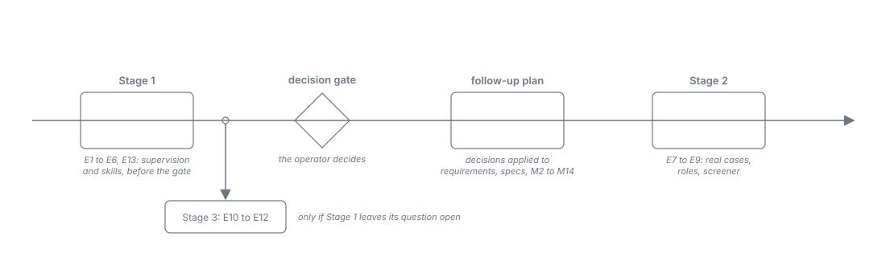

= Harness as Worker: Evaluation of the Open Issues
:toc: left
:toclevels: 2
:nofooter:

xref:README.adoc[Overview] · xref:analysis.adoc[Analysis] · xref:journey.adoc[Journey] · xref:measurements.adoc[Measurements] · xref:record.adoc[Run Record] · xref:findings.adoc[Findings] · xref:conclusion.adoc[Conclusion] · xref:architecture.adoc[Architecture] · xref:task-protocol.adoc[Task Protocol] · xref:roles.adoc[Roles] · xref:skills.adoc[Skills] · *Evaluation*

NOTE: *Status: complete (2026-10-04). Stages 1 and 2 measured on Claude Code and OpenCode; Antigravity's cells extrapolated, not measured (its quota ran out; the operator decided not to wait); <<e4>> measured with the operator, answering <<e10>> and the interactive cell of <<e13>>; Stage 3 otherwise not triggered.* Every item states its result below its criterion; the runs are in xref:record.adoc#evaluation-stage-1[Run Record].

The plan to verify what Milestone 0, Part A left open (xref:conclusion.adoc[Conclusion]): the supervision of workers that the harness as worker depends on, and the parts of the target picture that the measurements did not reach. Each item states a requirement on the verification, its method, the pass criterion and the fallback; criteria are confirmed by the operator before the first measured run, as in Part A.

== Ground rules

* *Final setup only*: every run uses the setup of the final series of Part A: worker directories outside the repository, the server under the product's name `plan-marshall`, tools loaded directly (`ENABLE_TOOL_SEARCH=false` on Claude Code), the `stdio` relay, and no more parallel runs than the model slots would allow, so that machine load does not move the figures.
* *Tooling*: the stub `de.cuioss.pm.mcp.spike` and the driver skill `test-pull` (removed after the evaluation, readable in git at commit `a6333d2`) are extended; every item becomes a scenario of the driver (`pull.py run eN`), not a skill of its own. The supervision logic of the job runtime lives in the driver for the spike; in the product it belongs to the server.
* *Record*: results go into xref:measurements.adoc[Measurements] and, with every run, into xref:record.adoc[Run Record]; xref:conclusion.adoc[Conclusion] is updated where a result changes it.
* *Harnesses and models*: Claude Code with `claude-haiku-4-5`, OpenCode with `space-bunny-free`, Antigravity with `gemini-3.8-flash-medium`, unless an item names others. A verification that the small model fails is repeated once with the next larger model; both results are recorded.

== Stages

[cols="1,3,2", options="header"]
|===
|Stage |Items |When

|1, before the decision gate
|<<e1>>, <<e2>>, <<e3>>, <<e4>>, <<e5>>, <<e6>>, <<e13>>
|On the existing stub; hours of work each. Decides whether supervised warm workers and consultation through the server are buildable. Measured; <<e6>> extrapolated.

|2, after the direction is decided
|<<e7>>, <<e8>>, <<e9>>
|Needs real fixtures from plan-marshall plan states and the role configuration of the decided direction. Measured; <<e7>> partly failed.

|3, optional
|<<e10>>, <<e11>>, <<e12>>
|Confirmations whose outcome the supervision protocol is designed to make irrelevant.
|===

Out of scope here, because the roadmap places them in Part B or later: writer jobs in confinement (coding with one writer per plan), the real relay `pm-mcp serve` with the relay requirements of xref:findings.adoc#connecting[Findings, Connecting hosts], and the headless spikes of the client profiles.

== Stage 1: the supervision protocol

[#e1]
=== E1 Task protocol with acknowledgement

*Requirement*: A worker must confirm every offered task, and the server must be able to tell a live worker from a lost one by the confirmation alone.

* *Method*: the stub offers tasks through the wait answer and expects an acknowledgement, in two variants: an explicit acknowledge call, and the first call that follows the task's link counted as acknowledgement. 200 tasks per harness and variant. Measured: latency from offer to acknowledgement (median, p99, maximum), tasks without acknowledgement, the extra cost of the explicit call per task (time and priced units).
* *Pass*: no task left without acknowledgement by a live worker; an acknowledgement deadline can be set above the p99.9 latency including provider stalls; the cheaper variant is recorded as the protocol's default.
* *Fallback*: if no deadline separates live from lost workers, liveness rests on process exit and silence alone (<<e2>>), and the acknowledgement becomes informational.
* *Result*: measured. Claude Code passes both variants (p99.9 6.4 s explicit, 2.8 s implicit): deadline 15 s. OpenCode passes implicit and fails explicit on its small model: a provider stall of 120.8 s left a live worker's task unacknowledged; the fallback model passes (p99.9 10.9 s). *Fallback taken for OpenCode*: the acknowledgement is informational, its deadline equals the silence limit (270 s). Default variant: explicit. Antigravity: extrapolated (deadline about 30 s).

[#e2]
=== E2 Detection, replacement, and fencing

*Requirement*: The server must detect a lost worker by process exit, silence, or a missing acknowledgement, end it, start a successor, and give the successor the lost worker's task exactly once; a submit of a replaced generation must be refused.

* *Method*: fault injection against two workers on one queue: `SIGKILL` between offer and acknowledgement and between acknowledgement and submit; `SIGSTOP` (a stall) shorter and longer than the silence deadline, then `SIGCONT`; the model ending its turn without submitting; the relay killed under a held call. Ten trials per fault and harness. The generation travels in the relay's environment, as the job token will.
* *Pass*: every task submitted exactly once; every lost worker detected within its deadline; the lease released at once on replacement, not by expiry; every submit of a replaced generation refused, including the resumed worker after `SIGCONT`; no stalled-but-alive worker replaced before its deadline.
* *Fallback*: if immediate release is unsafe, release by lease expiry (the behaviour measured in V9).
* *Result*: measured, passed on all three harnesses (six faults, ten trials each). Detection by exit within about 1 s and by silence within the deadline; the lease released at the fence; every late submit of a replaced generation refused. Silence grace 30 s confirmed. No fallback needed.

[#e3]
=== E3 Idle and budget recycling

*Requirement*: The server must end a worker before it gives up on its own, both after an idle period and when its context approaches the token budget, and must serve the next task without a delay beyond one fresh start.

* *Method*: a four-hour run per harness with sparse work: one task every 10 to 40 minutes at random. Variant A without recycling (the reference, expected to reproduce the give-up of V2), variant B with an idle timeout of a few wake-ups and a token budget taken from the per-turn usage. A second scenario fills the context with large tasks until the budget triggers.
* *Pass (variant B)*: no worker stops on its own; no task waits longer than the bounded wait plus one fresh start (about 10 s); the budget recycle fires before the loop breaks (for Haiku below 100k tokens). Recorded: the cost of variant B against keeping a worker warm (V6) and against fresh jobs only (V5).
* *Fallback*: fresh jobs only for the roles concerned.
* *Result*: measured, variant B passed on Claude Code and OpenCode: no worker stopped on its own, the longest wait of a due task 5.0 s (Claude Code) and 23.8 s (OpenCode), the budget recycle at 83k tokens on Haiku. Neither harness reproduced the give-up of V2 in variant A under held waits; variant B cost less than A (OpenCode 61k against 132k priced units, Claude Code 472k against 503k). Antigravity: extrapolated. No fallback needed.

[#e4]
=== E4 Session first, headless fallback

*Requirement*: A task may be offered first to the interactive session that started the plan; when the session does not acknowledge in time, a headless worker must take the task, and the plan must never wait on the session.

* *Method*: an interactive session on each of Claude Code and OpenCode runs the protocol beside a headless standby worker for an hour; tasks arrive every few minutes. The operator works with the session normally in between (questions, `/clear`, a compaction). Measured: share of tasks taken by the session, delay of tasks the session missed, duplicate work.
* *Pass*: every task done exactly once; no task delayed beyond the acknowledgement deadline plus one fresh start; the operator's input never queued behind a pull for longer than one bounded wait.
* *Fallback*: tasks go to headless workers only; the session is entry and viewer.
* *Operator*: needed for the whole hour, at the points the checklist names.
* *Result*: measured on 2026-10-04, passed on both harnesses by the criterion: every task accepted exactly once, the session took 15 of 16 (Claude Code) and 16 of 16 (OpenCode) tasks, no task delayed beyond its limit, the operator's input taken in within one bounded wait. The limits lie beside the criterion: on OpenCode the session's reply to the operator waits for the end of its loop, `/new` leaves the old loop running invisibly, and two loops under one identity decide every task twice. *Outcome*: the session may take tasks on Claude Code; on OpenCode only once a new session gets a new generation that fences the old loop, and the operator is told that the session answers after its loop.

[#e5]
=== E5 Consultation through the server

*Requirement*: A worker that needs another model's judgment must ask through the server: it submits a consultation, the server runs it as a job, and the answer arrives through the asker's next wait, deterministically and within the single-level leaf constraint.

* *Method*: tasks whose result requires a second opinion (for example a triage decision that must be confirmed by a reviewer role). The asker submits a consultation link instead of a result; the stub runs a fresh consultant job; the asker waits within the bounded wait (with progress frames where the host needs them) and receives the answer. 50 consultations per harness, with consultants on the same and on another harness.
* *Pass*: every consultation answered exactly once and delivered to the right asker; no asker leaves its loop while waiting; latency within the asker's bounded wait or covered by progress; the asker's final submit refers to the consultation.
* *Fallback*: the workflow models the consultation as two sequential tasks, and the asker does not wait.
* *Result*: measured. Every consultation (100 in four runs) was answered once and delivered to the right asker, on the same harness and across harnesses; no asker left its loop; the longest answer (286 s) was covered by progress frames. Haiku failed the reference criterion by breaking its own submit call in one session (the fallback model passed); the protocol is not at fault, and the product refuses a submit without its reference. Antigravity: extrapolated. No fallback needed.

[#e6]
=== E6 Antigravity as a concurrent job host

*Requirement*: Several Antigravity jobs must be able to run at the same time behind the one global server entry, each bound to its own identity.

* *Method*: the relay takes identity and generation from its environment instead of its arguments; two and four concurrent `agy` jobs run the V9 scenario with waits of 150 s.
* *Pass*: every task bound to the right job; exactly-once redelivery after kills as in V9; no wait reaches the 180 s limit.
* *Fallback*: Antigravity runs one job at a time, or no model jobs (as decided for v1).
* *Result*: extrapolated, not measured (quota exhausted; the operator decided on 2026-10-04 not to wait). The smoke run bound two concurrent jobs correctly with the identity taken from the environment, and E2 showed detection and fencing on Antigravity as on the other hosts; so the mechanism works. Four jobs and waits of 150 s are not shown, and Antigravity remains the weakest host; *fallback kept for v1*: Antigravity runs no model jobs until a measurement shows the load.

[#e13]
=== E13 Skill delivery

*Requirement*: Every worker must have the skills its task requires in its context when it works on the task, delivered by the server in the structures of the MCP Skills Extension (xref:skills.adoc[Skills]), and the shim must make every harness treat them as binding.

* *Method*: on the stub, tasks whose correct decision depends on a rule that exists only in a role or state skill (for example a commit-type rule that contradicts common practice). Delivery in the offer to warm workers, once per generation and again after a budget recycle and after a compaction the harness reports; in the prompt file of fresh jobs; to the interactive session through `pm_skill` with the shim skill installed in each harness. A control without the skill. The stub additionally answers `skills/list` and `resources/read`, and a test client declaring the extension shows the switch to delivery by URI.
* *Pass*: decisions follow the skill rule at the rate the operator sets before the run, in every delivery form, and clearly above the control; every skill is delivered again when its context may have been lost (new generation, reported compaction, changed digest); no offer goes out without its required skills; the switch to delivery by URI happens per connection when the client declares the extension.
* *Fallback*: required skills in-band in every offer instead of once per generation; for a harness on which the shim does not work, no interactive task offers.
* *Result*: measured on Claude Code and OpenCode, headless: the skill rule followed in 100 % of the decisions in every delivery form, against 0 % in the control; re-delivery after every new generation, reported compaction (synthetic), and changed digest; no offer without its skills; the switch to delivery by URI on the declaring connection only. The interactive cell is answered by <<e4>>: on both harnesses a session that had lost the task-protocol skill read it through `pm_skill` when an offer named it by URI. Antigravity: extrapolated. No fallback needed.

== Stage 2: the target picture

[#e7]
=== E7 Quality of open-ended decisions

*Requirement*: The roles that the target picture assigns to models must decide real, open-ended cases at a quality the operator accepts, warm and fresh.

* *Method*: fixtures taken from plan-marshall plan states, each with a reference decision by the operator: re-planning after a failed task and after the base of a running plan moved (the case of `plan-v02-08-fapi-2-0-conformance`: 24 conflicted files after `main` advanced during finalize, then a pull request above a reviewer's file limit; xref:roles.adoc#re-planning[Roles, Dynamic re-planning]), triage of build and CI failures that do not map to a known cause, triage of PR comments and Sonar findings, the security and simplify reviews, and the two questions of the pre-submission self-review separately (does the code implement the requirement correctly and completely; is the code itself correct and compliant). Every fixture warm and fresh, per harness and model of the role configuration.
* *Pass*: agreement with the reference decisions at or above the level the operator sets before the run; warm within 5 points of fresh; the split review finds at least what one combined review finds; for re-planning, the revised outline and tasks pass the server's plan guards.
* *Fallback*: per role, a larger model or effort level; a role that fails at every level stays with the operator.
* *Result*: measured. The security, simplify, and self-reviews pass at 100 %, warm and fresh, and the split self-review finds what the combined one finds. Sonar triage passes fresh on the small model and in both forms on Sonnet (87.5 %); its warm form on the small model drifts (50 %). PR comment triage passes in every form (80 to 90 %) after five contested references were resolved from all answers and one case gained the evidence its reference rests on; build and CI triage (62.5 to 75 %, even after the resolution) and re-planning (60 to 74 %) fail on both levels. *Fallback taken*: build and CI triage and re-planning stay with the operator until more cases show otherwise; Sonar triage runs fresh, or warm on Sonnet.

[#e8]
=== E8 Typed roles across harnesses

*Requirement*: Every worker role must run on the harness and model its configuration names (per project or machine), with its class, tool set, and effort level, and its usage must be accounted in one place.

* *Method*: a plan-like sequence with every role of the target picture: the main thread and planning on OpenCode, coding on Claude Code, reviews on Antigravity (or the configuration the direction decides). Then the configuration is changed per project and the sequence repeated.
* *Pass*: each role ran where configured, with its tool set and nothing else; usage of all roles in one account; a configuration change took effect without code changes.
* *Fallback*: one harness for all roles of a project.
* *Result*: measured, passed. Every role of a plan-like sequence ran on the harness, model, and effort its configuration named, with its tool set and nothing else; usage per role in one report; moving triage and reviews to the other harness was a change of the configuration set, not of the code. Antigravity as a review host is extrapolated, not measured (quota): the routing is the same for every harness, the review quality on its models is unknown.

[#e9]
=== E9 Screener effectiveness and form

*Requirement*: Untrusted text must be caught before it reaches a worker, since V8 showed injected text acting on the task that carries it; and the form of the screener must be chosen: the fresh zero-tool job of the specification, or the warm contained model of the operator's target picture (xref:roles.adoc#untrusted-content[Roles, Untrusted content]).

* *Method*: after the deterministic level-1 cleanup, both forms against the five injection variants of V8, further variants written for the evaluation, and clean real samples (PR comments, Sonar messages): (a) the screener as specified (server-fixed prompt, no tools, isolated directory, one turn), (b) a supervised warm screener whose only tools are wait and submit. For (b) additionally: whether a screened injection changes later verdicts of the same worker.
* *Pass*: every injection variant flagged `suspicious`; false positives on clean samples at or below the rate the operator sets before the run; for (b) no change of later verdicts. The form is chosen by the result and the cost per verdict.
* *Fallback*: tighter deterministic validation at level 1; a stronger screener model.
* *Result*: measured. Both forms flagged every injection; their false positives (23 to 27 %) were review-bot boilerplate. *Fallback taken*: level 1 removes the disclosure footers of review bots. Then the fresh zero-tool job passes (3.3 % false positives, 0.018 USD and 7 s per verdict); the warm screener fails, because a screened injection changed a later verdict. *Form chosen*: the fresh zero-tool job of the specification.

== Stage 3: optional confirmations

*Triggers, checked on 2026-10-04*: <<e11>> is not triggered (<<e3>> passed on OpenCode), <<e12>> is not triggered (the budget recycled Haiku at 83k tokens, below the break at 135k of V3), <<e10>> is answered by <<e4>>.

[#e10]
=== E10 The interactive session in the final setup

*Requirement*: V10 must be confirmed in the final setup (directory outside the repository, product server name), because both interactive sessions of Part A ran in the first setup.

* *Method and pass*: as V10. Only needed if <<e4>> does not already give the answer.
* *Result*: answered by <<e4>>, which ran in the final setup: the interactive session keeps the protocol through `/clear` and compaction on Claude Code, and on OpenCode loses its visible loop to compaction while `/new` leaves the old loop running. Not run separately.

[#e11]
=== E11 Other models as pullers on OpenCode

*Requirement*: Whether OpenCode with a model other than `space-bunny-free` holds the pull loop.

* *Method and pass*: V2 with one or two further models available to the operator. Only needed if <<e3>> fails, since idle recycling is meant to remove the give-up.

[#e12]
=== E12 Automatic compaction in a warm worker

*Requirement*: Whether a headless warm worker keeps its loop through an automatic compaction.

* *Method and pass*: a warm worker filled past its harness's compaction threshold with recycling switched off; the loop must continue. Only needed if the token budget of <<e3>> cannot be kept below the compaction point.

== Accepted gaps of Part A, not planned

Measured partly in Part A and left as they are, because no decision depends on them:

* V5 with a cold provider cache and the reference text on Claude Code and OpenCode (the minimal cold cell is measured).
* V6 on OpenCode with waits above its 60 s limit (it needs progress frames, which a worker gets anyway).
* V3 in full length on Antigravity (three of six rounds measured; its weak points as a host are known from V1, V5, V7, and V9).
* Reliability at model levels above the small one, except V3 on Claude Code; covered per role by the fallback of <<e7>>.

== Next steps outside this plan

* *Decision gate* (xref:analysis.adoc#gate[Analysis]): the operator decides direction, form of small decisions, deterministic server logic, and watching; Stage 1 of this plan is meant to come first.
* *Applying the decisions*: a follow-up plan writes the decisions into the requirements, the specifications, and roadmap Milestones 2 to 14, among them the task protocol as a sub-workflow of the workflow DSL, worker lifecycle and supervision in the job runtime, generation and lease fields in the store schemas, the roles as configuration artifacts with one abstract model caller (xref:roles.adoc#configuration[Roles]), and the relay requirements.
* *Part B of Milestone 0*: writer jobs in confinement, the real relay `pm-mcp serve`, the headless spikes of the client profiles, and the remaining technical verifications.
* *Removing the spike tooling*: the stub package and the `test-` skills go with Milestone 1.
