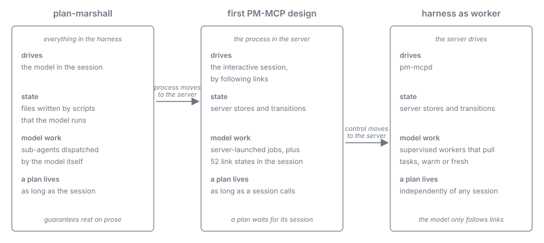
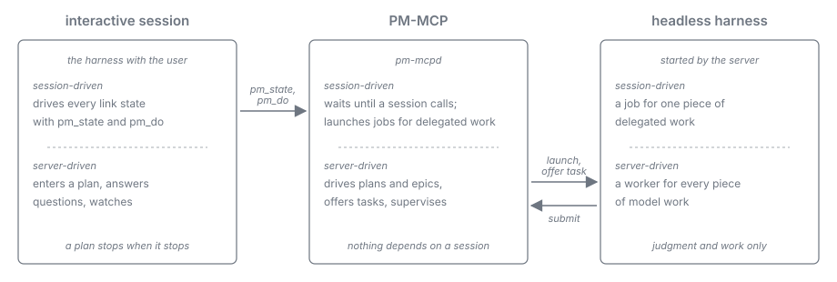

= Harness as Worker: Journey
:toc: left
:toclevels: 2
:nofooter:

xref:../../Concepts.adoc[Concepts] » xref:README.adoc[Harness as Worker] » Journey

xref:README.adoc[Overview] · *Journey* · xref:architecture.adoc[Architecture] · xref:task-protocol.adoc[Task Protocol] · xref:roles.adoc[Roles] · xref:skills.adoc[Skills]

How the place of control moved, in three steps, from the harness to the server: from plan-marshall, where the model in the harness runs the process, over the first design of `PM-MCP`, where the server owns the process but a live session still drives it, to the harness as worker, where `PM-MCP` drives the process and calls on the harness and its model only for judgment and work.

Each step moves a responsibility one place further from the model, along the chain operator → server → harness → model.

== Step 1: plan-marshall, everything in the harness

plan-marshall implements its process as a corpus of skills and Python scripts that the model of an interactive harness session loads and executes.

* *The model is the process engine.* It reads the workflow documents, decides the next step, runs the scripts that change the state files, and dispatches sub-agents from inside the session.
* *Every guarantee depends on the model following prose.* The known defects of that design are the consequences: a leaf transitions the plan phase itself; skill lists drift from the contract; a sub-agent asks the operator although it must not; workflow documents resolve from a stale cache; a cold start is expensive because the sub-agent loads its own context through tool calls; usage is known only from the session's own transcript.
* *A plan lives as long as the session.* When the session ends, is cleared, or compacts, the process stops or must be reconstructed from files by the next model.

== Step 2: the first PM-MCP design, the process in the server

`PM-MCP` takes over the process logic. The server owns state and transitions; the model asks for the current state (`pm_state`) and receives it with the valid next transitions as links, and moves the scope by following one (`pm_do`). The server validates every transition on its own (hypermedia-driven workflow).

* *What moved left*: state, transitions, validation, builds, git and provider operations, the stores, the audit trail. Most states move by the server alone.
* *Sub-agents became server-launched jobs*: every delegated piece of work runs as a headless harness process that the server starts, confines, binds to one entity with a job token, accounts for, and evaluates.
* *What stayed in the session*: the decisions inside a running plan that needed a model, which the interactive session moved by `pm_do` (task planning, remediation decisions, git recovery, self-review, applying proposals). The consequences: a plan stops when the session does; the session is an unconfined writer outside the confinement and the one-writer rule; an epic cannot start its plans; and much of the design exists only to survive the loss of the driving session.

The process logic moved to the server. The direction of control did not: the server still waits for a session to call.

== Step 3: harness as worker, the server drives

`PM-MCP` becomes the driver of plans and epics. The harness and its model are workers that the server starts, feeds, watches, and replaces; the model is consulted for judgment and asked for work, and never decides what happens next.

* *Workers pull tasks.* A worker holds a wait call open; the server answers it with a task (in MCP the server cannot push into a harness, so the task is the answer to a pending call). The worker acknowledges, does the task by following the links of the task's representation, submits a structured result, and waits again, or ends when the server tells it to.
* *The server supervises every worker.* Identity and generation travel in the relay, not in the model; a task is leased to one generation; a missing acknowledgement, a silent worker, or an exited process makes the server end the worker as lost and give the task to a successor exactly once; an idle period or a full token budget ends a warm worker by recycling, through "end" at its next wait.
* *Warm where it pays, fresh where it does not.* Roles with frequent small decisions can keep a warm worker while there is work; everything else runs as a fresh job. Both decide equally well on closed decisions (link:../../specification/evaluation.adoc#results[Evaluation Reference, Results]); the warm worker saves the start and pays for its context on every turn.
* *The interactive session is the entry and the viewer.* It turns the user's words into a plan, answers questions, and may take a task when it is attentive; when it does not acknowledge, a headless worker takes over. The plan never depends on it.
* *A model that needs another model asks the server.* A consultation is a task like any other, run as a job and answered through the asker's next wait, so the flow stays deterministic and inside the single-level leaf constraint.
* *Typed roles.* Every worker role has a declared class (`read_only`, `writer`, `zero_tool`), tool set, effort level, and, per project or machine, its own harness and model.

== Why the third step is justified

Measurements on three harnesses show that the mechanism the harness as worker rests on works: a headless worker holds its loop under supervision, a lost worker's task comes back exactly once, a replaced worker's late submit is refused, warm and fresh workers decide alike, and server-delivered skills bind every worker. They also show what the server has to take over because neither the transport nor the model provides it: the server learns of a lost worker only from the process, the acknowledgement, and silence, and it recycles workers before they give up or their context grows too large. The interactive session cannot be a driver: it pauses or stops on its own. The figures are in the link:../../specification/evaluation.adoc[Evaluation Reference]; the parts are described in xref:architecture.adoc[Architecture].
