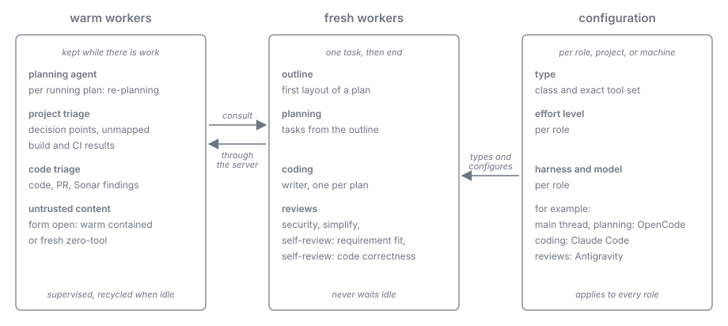

= Harness as Worker: Roles
:toc: left
:toclevels: 2
:nofooter:

xref:README.adoc[Overview] · xref:analysis.adoc[Analysis] · xref:journey.adoc[Journey] · xref:measurements.adoc[Measurements] · xref:record.adoc[Run Record] · xref:findings.adoc[Findings] · xref:conclusion.adoc[Conclusion] · xref:architecture.adoc[Architecture] · xref:task-protocol.adoc[Task Protocol] · *Roles* · xref:skills.adoc[Skills] · xref:evaluation.adoc[Evaluation]

NOTE: *Status: proposal, measured (2026-10-04)*. The operator's target picture of the model work per project, with what the measurements of Milestone 0, Part A and its evaluation say about each part.

Every model process is a worker of a role. A role fixes the worker's type (class and tool set), whether it is kept warm or started fresh, and its configuration (effort level, harness, model). All workers follow the xref:task-protocol.adoc[Task Protocol].

[#target-picture]
== Warm workers per project

Kept while there is work, supervised, and recycled when idle or when the token budget is reached.

[cols="2,3,3", options="header"]
|===
|Role |Scope |Assessment

|Planning agent, per running plan
|dynamic re-planning: reconsidering a concrete plan when its premises change while it runs (<<re-planning>>)
|The mechanism is measured (V2, V3, V9, E2, E3). Re-planning on real cases reached 60 to 74 % of the essential properties on Sonnet and Opus, below the operator's level (xref:evaluation.adoc#e7[E7]): it stays with the operator for now. Most of the time there is nothing to re-plan, so the role needs the idle recycle (xref:evaluation.adoc#e3[E3]).

|Project triage, the main agent
|smaller questions and decision points; triage of build and CI results that cannot be mapped directly; when a plan was started from an interactive session, that session can take this part
|The mechanism is measured (V2, V3, V9, E2, E3). Triage of real build and CI output reached 62.5 to 75 % on the small model and on Sonnet, below the operator's level (xref:evaluation.adoc#e7[E7]): it stays with the operator for now. The role is idle much of the time, so it needs the idle recycle (xref:evaluation.adoc#e3[E3]). The interactive session can take part only with a headless fallback (V10, xref:evaluation.adoc#e4[E4]).

|Code triage
|code, PR, and Sonar findings
|Measured on real findings (xref:evaluation.adoc#e7[E7]): review comments 80 to 100 %, static-analysis findings 87.5 % fresh, or warm on Sonnet (the small model drifted warm).

|Untrusted content verification
|see <<untrusted-content>>
|decided by E9: a fresh zero-tool job, not a warm worker
|===

== Fresh workers

Started for one task and ended after its submit.

* *Outline* and *planning*.
* *Coding*, as the execution context of a task. A writer worker: one at a time per plan, in confinement (Milestone 0, Part B).
* *Reviews*:
** security review;
** simplify review;
** pre-submission self-review, split into two review workers: (a) does the code implement the requirement correctly and completely, (b) is the implementation itself correct and compliant with the rules.

The quality of these roles on real cases is part of xref:evaluation.adoc#e7[E7]. A fresh worker never waits idle, which is the situation in which workers gave up in Part A; its cost is in xref:measurements.adoc[Measurements] (V5).

[#re-planning]
== Dynamic re-planning

A plan is laid out once, in outline and planning, against the state of the project at that moment. A long-running plan can outlive that state. Then the plan has to be reconsidered as a whole, not repaired step by step.

=== The case that shows it

`plan-v02-08-fapi-2-0-conformance` in API-Sheriff (archived 2026-10-02, `.plan/local/archived-plans/2026-10-02-plan-v02-08-fapi-2-0-conformance` in that repository) ran for 39 hours, from 2026-10-01 06:00 to 2026-10-02 21:10, with 12 deliverables and about 30 million tokens.

* *The base moved under the plan.* While the plan was in finalize, `main` advanced by seven commits, among them a change to the session routes (#369) that touched the same flows. The pull request became unmergeable; a trial merge showed 24 conflicted files.
* *The process could only step back.* With its loop-back ceiling already spent (five rounds of a non-converging self-review), the plan went from finalize back to execute only by an operator decision ("re-integrate on this plan"): merge `main`, bring the new flows under the plan's own requirements (PAR and DPoP binding), renumber the decision record and the log identifiers, correct the documents, re-run all verification, and skip a further self-review.
* *More premises fell afterwards.* The merged change had grown to 117 files, above the limit of a required reviewer; a second operator decision split it into two pull requests. The merge queue landed the result after the landing budget had expired, and cleanup needed a fresh finalize entry.
* *Every turn was an operator decision*, against the rule that the process enforces itself, and each was taken without a revised plan: the outline and tasks of the plan were never updated to the new situation; the plan's documents record the outcome only as residue.

=== What it needs

image::../../resources/harness-as-worker-re-planning.svg[Dynamic re-planning: a trigger in a running plan, the planning agent choosing an offered action, the server guards, and the re-entry at execute; hand back ends by the defined fallback, align=center]

* *Triggers the server detects on its own*, deterministically: the base branch advanced with changes that overlap the plan's footprint; a trial merge conflicts (with the number of files); a limit of a downstream gate will be exceeded (pull-request size, a reviewer's file limit); a loop-back ceiling is reached or a review does not converge; a budget is exceeded.
* *A planning agent that reconsiders the concrete plan.* On a trigger the server offers the planning agent a re-planning task: the plan's outline, tasks, done deliverables, footprint, and the trigger's facts (for example the upstream commits and the conflicted files). The agent chooses among actions the server offers as links, for example: re-integrate in this plan (new tasks for the merge and for bringing the new code under the plan's requirements, re-entry at execute); split the change (new pull requests or a follow-up plan for part of the deliverables); defer the conflicting part to a follow-up plan; rebase and re-verify only; hand back. It submits the revised outline and tasks through the plan's ordinary submit links, so the server's guards check them like a first plan.
* *Warm while the plan runs.* The agent is kept warm per running plan so that a trigger is answered without a start; its knowledge comes from the plan's representation, not from its own history, so recycling it (idle, budget) loses nothing.
* *The operator only by waiver.* The planning agent's decision replaces the in-run operator decisions of the case; an action the server cannot offer within the plan's guards ends the plan by its defined fallback, not by a question.

The quality of such decisions is untested; this case is one of the fixtures of xref:evaluation.adoc#e7[E7].

[#untrusted-content]
== Untrusted content

Untrusted text (PR comments, Sonar messages, web content, issue bodies) is cleaned up on the server first, by the deterministic level-1 validation, and then checked by a model for harmful instructions before it reaches any worker.

The form of that model was open between two variants; xref:evaluation.adoc#e9[E9] chose the first:

[cols="1,3,3", options="header"]
|===
| |Fresh zero-tool screener (specification) |Warm contained screener (operator's picture)

|Form
|a fresh job per batch, server-fixed prompt, no tools, isolated directory, one turn, fail-closed
|a supervised warm worker whose only tools are wait and submit

|For
|nothing to misuse, nothing carried from one batch to the next
|no start cost per batch; no carry-over between tasks was found (V8)

|Against
|a start per batch
|a pulling worker keeps tools; injected text did act on the task that carried it (V8)
|===

xref:evaluation.adoc#e9[E9] compared both forms on the same injection variants and clean samples. *Chosen: the fresh zero-tool job.* With level 1 removing the disclosure footers of review bots, it flagged every injection at 3.3 % false positives for 0.018 USD per verdict; the warm screener changed a later verdict after a screened injection (xref:record.adoc#evaluation-stage-2[Run Record, Stage 2]).

[#configuration]
== Roles are configuration

The operator's rule (2026-10-04): no role is fixed in the code. A role is one configuration artifact, and the roles that exist are exactly the artifacts present; a workflow names a role by its name, and any name the configuration defines can be used.

* *The artifact defines everything about the role*: its description, its class (reader, writer, zero-tool) and its tool set of exact tool names, the harness, model, and effort level it runs on, its form (a warm worker that takes task after task, or a fresh job per task), how many workers or jobs run at once, its skills (the role skill is its contract, xref:skills.adoc[Skills]), whether it may consult another role, and its recycling rules (idle wake-ups, token budget, tasks per generation).
* *One abstract caller*: the server has a single model caller. It reads the artifact of the role a workflow state names and acts on it: it starts and supervises a warm worker or launches a fresh job, on the configured harness and model, with the configured tools and skills. Nothing else in the server knows what a role is for.
* *Sets of artifacts*: the artifacts form a set per project or machine (with the usual precedence of project over machine over the shipped defaults); changing a role, adding one, or moving it to another harness is an edit of the set, never a code change. A workflow that names a role the set does not define is refused when the workflow is composed, not when the state is reached.
* *Example assignment*, the operator's picture: OpenCode for planning and the main thread, Claude Code for coding, Antigravity for reviews. The Stage 2 configuration of the evaluation is another set (xref:evaluation.adoc#e8[E8]).
* *Host suitability* constrains the sets, not the code: Claude Code fits well as a worker host; OpenCode with `space-bunny-free` held the pull loop under supervision (xref:evaluation.adoc#e3[E3]), and some free OpenCode models refuse a restricted agent (xref:findings.adoc#evaluation[Findings]); Antigravity has the weakest profile, and several concurrent workers there depend on xref:evaluation.adoc#e6[E6] (figures in xref:measurements.adoc[Measurements]).

*Measured outcome per role* (xref:evaluation.adoc#e7[E7]): the reviews (security, simplify, self-review) decide at 100 % on Sonnet, warm and fresh; Sonar triage at 87.5 % fresh, or warm on Sonnet; PR comment triage at 80 to 90 % in every form; build and CI triage and re-planning did not reach the operator's level on any model and stay with the operator for now. Routing across harnesses by configuration works (xref:evaluation.adoc#e8[E8]). Which configuration a role should run on is graded against the model verification corpus (`test/model/verification/README.adoc`, section "Grade a model and effort level for a role"; as a product function xref:../../later-improvements.adoc#_l_10_role_qualification_against_the_verification_corpus[Later Improvements L-10]).

The evaluation driver worked this way (in git at commit `a6333d2`): `fixtures/roles/<set>/<name>.json` of the skill `test-pull`, read by its caller `roles.py`.

== A worker asks another role

A worker that needs another model's judgment, for example project triage asking a review role, asks through the server (xref:task-protocol.adoc#consultation[Task Protocol, Consultation]). The consultation is a workflow step, so it is always deterministic, and it stays within the single-level leaf constraint (xref:evaluation.adoc#e5[E5]).
