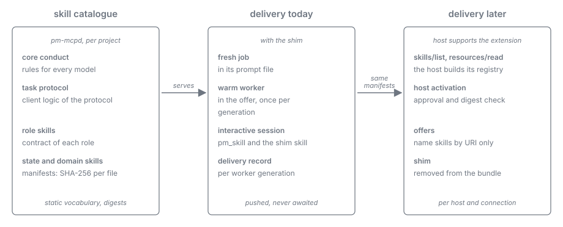

= Harness as Worker: Skills
:toc: left
:toclevels: 2
:nofooter:

xref:../../Concepts.adoc[Concepts] » xref:README.adoc[Harness as Worker] » Skills

xref:README.adoc[Overview] · xref:journey.adoc[Journey] · xref:architecture.adoc[Architecture] · xref:task-protocol.adoc[Task Protocol] · xref:roles.adoc[Roles] · *Skills*

A core feature of plan-marshall is that a model gets exactly the skills its work needs, deterministically chosen and reliably loaded: the execution context loads the persona and the listed skills in order, and a skill that cannot be loaded fails the dispatch. The requirements carry this into `PM-MCP` (xref:../../requirements/03-skills.adoc[Skill Generation & Delivery], `PM-SKILL-1` to `PM-SKILL-4`): static vocabulary skills per project with deterministic digests, delivered through MCP tools and resources, dynamic state only in representations, and a model job's skills in-band in its server-composed prompt.

The harness as worker adds three recipients with their own needs: warm workers that serve many tasks with different skill needs, a task protocol whose client logic every worker must know, and an interactive session that may take a task. This document explains how the skills reach all of them.

== All client logic is a skill

Everything a worker must know to act, other than the facts of the task, is a skill. Nothing of it lives in prompt text written for one occasion. A worker does load the project's own instructions and harness skills natively from its working directory, because they carry the project's conventions; what `PM-MCP` requires of the worker never depends on them.

The skills fall into five kinds:

* *Core conduct* holds what every model needs: it follows the offered links, never acts outside them, and delivers only through submit links.
* *The task protocol* is the client logic of the xref:task-protocol.adoc[Task Protocol]: what a wait, an offer, "wait again", and "end" mean, how a worker acknowledges, works along the links, submits, and consults another role.
* *A role skill* is the contract of a role, for example `replan`, `triage-review`, or `review-code`: what it decides, by which criteria, and what its result means.
* *State skills* carry the guidance of one workflow state.
* *Domain skills* carry the standards of a technology active in the project.

Their URIs and how the server serves them are specified in the link:../../specification/mcp-tools/02-service-and-skill-tools.adoc[MCP Tools Specification, Service & Skill Tools].

The rules of `PM-SKILL-1` apply unchanged: skills are static vocabulary, never commands, paths, or per-plan content. A contract in a skill names link relations and their meaning; the concrete links, facts, and result schemas of a task arrive in its representation.

Skills are not only compiled: the operator for the machine and the team for its project add extension skills as directories of `SKILL.md` files, which the server serves and delivers like its own under `skill://pm/ext/`, so a new role brings its contract without a code change and a project's conventions reach every worker. An extension skill is untrusted input: the server validates it on every read and refuses it whole on any doubt, it never decides a gate or a link, and a changed contract leaves its role unqualified until it is graded again.

[#structure]
== One structure: the MCP Skills Extension

The server publishes its catalogue in the structures of the MCP Skills Extension (`io.modelcontextprotocol/skills`, SEP-2640; analysis in xref:../../discussions/mcp-skills-extension.adoc[MCP Skills Extension]):

* every skill is a `SKILL.md` with its supporting files, each an MCP resource under `skill://pm/…`;
* every skill has a manifest: its `SKILL.md` URI, its frontmatter, and every file with its SHA-256 digest and size;
* the server declares the extension and answers `skills/list`, `skills/get`, and `resources/read`.

Hosts that do not speak the extension yet reach the same catalogue through skill tools that mirror it (link:../../specification/mcp-tools/02-service-and-skill-tools.adoc[MCP Tools Specification, Service & Skill Tools]). The tools are a mirror, not a second format, so nothing changes in the catalogue when a host starts to speak the extension.

The rules of the extension hold from the start, whether a host enforces them or not: no `dynamic` skills, a digest for every file, one origin, and no skill that instructs code execution on the host.

[#delivery]
== Deterministic delivery

For every task the server computes the required skill set: core conduct, task protocol, the role's skill, the state's skills, and the domain skills of the project, each identified by URI and digest. How the set reaches the model depends on the recipient:

[cols="2,4,4", options="header"]
|===
|Recipient |Without host support |When the host supports the extension

|Fresh job
|In-band in the server-composed prompt file; above the size bound, a section index with `skill://` URIs to fetch through `pm_skill`.
|Unchanged: the prompt is the server's.

|Warm worker
|Core conduct, task protocol, and role skill in-band in the launch prompt. Each offer carries in-band the required skills that this worker generation has not yet received, and names the others by URI and digest.
|The offer names the skills by URI and digest; the host loads and activates them through its own skill path and verifies the digests.

|Interactive session
|The shim skill of the client bundle, and `pm_skill` for every skill a representation names; an offer to the session carries its skills in-band like an offer to a warm worker.
|The host lists and activates the catalogue itself; the shim is removed from the bundle.
|===

The server remembers per worker generation which skills it has delivered. A successor is a new generation and starts with nothing, so it receives everything again; nothing depends on what a predecessor knew.

[#enforcement]
== What the server can and cannot enforce

The server relies on delivery, not on request: a required skill reaches the model in the same answer that carries the task, which the model has to read to get the task at all. Asking the model to fetch a skill, or to repeat its digest as proof, would prove nothing. For the same reason a task is offered only together with the skills it needs; what does not fit into an offer travels in a fresh worker's launch prompt.

A context can lose what it once received. The server therefore delivers a skill again wherever it has reason to doubt that the model still holds it: to a new generation, after a clear or compaction the harness reports, and when the skill itself changed. What the host does not report the server cannot see; the shim covers that case.

What the server cannot enforce is that the model applies a skill. It checks every result against the link and schema the contract names, whatever the model made of the skill, and leaves the rest to measurement and to role qualification (xref:roles.adoc#qualification[Roles, Qualification]). The rules are specified in link:../../specification/model-work/04-worker-launch.adoc#skill-delivery[Model Work Specification, Skill Delivery].

[#shim]
== The shim

None of the three harnesses activates skills that an MCP server serves (xref:../../discussions/skills-host-support.adoc[Skills Host Support]). The missing host capability is replaced by one small skill that is removed again when a host provides it.

* *What it is*: a host-native skill in each client bundle (in the host's own skill format and directory), and the same paragraph in every server-composed prompt file. It states the convention and nothing else: skills of `plan-marshall` arrive in-band in answers or are named by a `skill://pm/` URI; a named skill is binding and is read through `pm_skill`, sections through their anchors; a skill is never reconstructed from memory; a skill of the same name from elsewhere does not replace it.
* *What it is not*: it never decides which skills to load. The server decides; the shim only makes the model treat what it receives as skills.
* *How it is removed*: per host and per connection. When a host implements the extension, it declares the extension's client capability when it connects; the server then switches that connection to host activation (offers name skills by URI only), and the client profile records the verified support, so the next client bundle no longer installs the shim. A machine with several hosts can run hosts with and without support side by side.

== Bootstrapping

The task protocol cannot teach itself through the task protocol. A headless worker therefore receives the core conduct and the task-protocol skill in its launch prompt, before its first wait. The interactive session receives the task-protocol skill in the first offer it takes, and the shim tells it how to read it.
