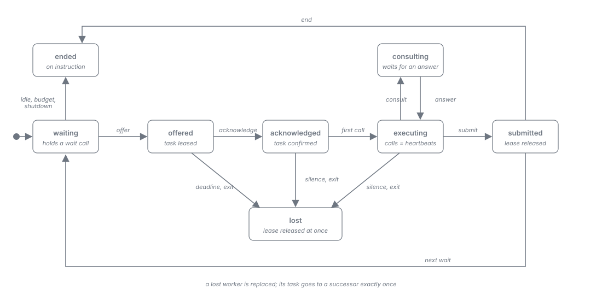
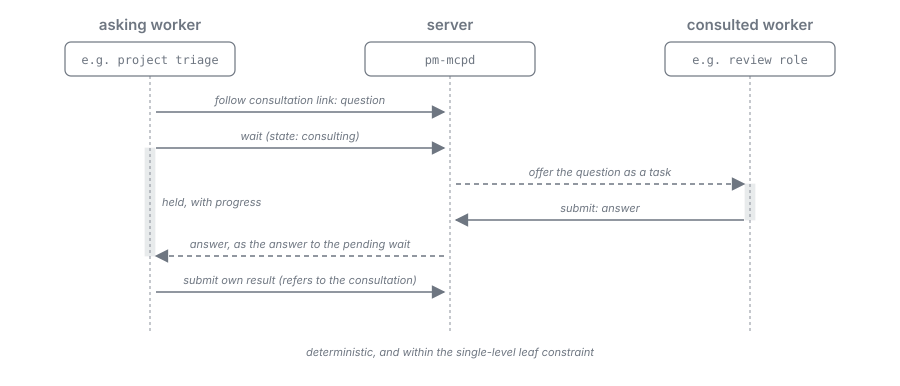

= Harness as Worker: Task Protocol
:toc: left
:toclevels: 2
:nofooter:

xref:README.adoc[Overview] · xref:analysis.adoc[Analysis] · xref:journey.adoc[Journey] · xref:measurements.adoc[Measurements] · xref:record.adoc[Run Record] · xref:findings.adoc[Findings] · xref:conclusion.adoc[Conclusion] · xref:architecture.adoc[Architecture] · *Task Protocol* · xref:roles.adoc[Roles] · xref:skills.adoc[Skills] · xref:evaluation.adoc[Evaluation]

NOTE: *Status: proposal (2026-10-04)*. The loop of wait, task, and submit is measured; the acknowledgement, detection, fencing, recycling, consultation, and skill delivery are measured on Claude Code and OpenCode in Stage 1 of xref:evaluation.adoc[Evaluation] (Antigravity extrapolated, the session-first offer open).

The exchange between the server and a worker. Every worker complies with it, whether the server spawned it or it is the interactive session that started the plan. The protocol is a reusable sub-workflow of the workflow DSL: every transition is server logic, and the model only follows the links it is offered.

== Steps

image::../../resources/harness-as-worker-task-exchange.svg[One task from offer to submit between workflow engine, task queue, and worker, including the wait-again answer and the acknowledgement, align=center]

. *Wait*: the worker holds a wait call open. The call is bounded below the host's limit by the client profile (<<parameters>>); where the host needs it, the server sends progress frames during the wait.
. *Offer*: the server answers the wait with a task. The task is leased to the worker's current generation and carries the skills it requires that this generation has not received yet (xref:skills.adoc#delivery[Skills, Deterministic delivery]). (MCP gives the server no way to make a harness act; the offer is always the answer to a pending call.)
. *Acknowledge*: the worker confirms the task, explicitly or by its first call that follows the task's link. The explicit call is the default: it was not the more expensive variant on any harness (xref:evaluation.adoc#e1[E1]). The acknowledgement tells the server that the worker is alive and has the task.
. *Execute*: the worker does the task by following the links of the task's representation. During long work its calls serve as heartbeats.
. *Submit*: the worker submits a structured result through the offered link. The server checks it against the lease and the generation and refuses a submit of a replaced generation.
. *Wait or end*: the server answers the next wait with the next task, with "wait again", or with "end".

== States of the sub-workflow

[cols="2,4,3", options="header"]
|===
|State |Meaning |Leaves to

|`waiting`
|the worker holds a wait call; no task leased to it
|`offered` (task available), `ended` (idle timeout, budget, shutdown), `lost` (silence, exit)

|`offered`
|a task is leased to the worker's generation, its required skills delivered; no acknowledgement yet
|`acknowledged`, `lost` (deadline passed, exit)

|`acknowledged`
|the worker confirmed the task
|`executing` (first call along the task's links), `lost`

|`executing`
|the worker works along the links; its calls are heartbeats
|`submitted`, `consulting`, `lost` (silence, exit)

|`consulting`
|the worker asked another role and waits for the answer
|`executing` (answer delivered), `lost`

|`submitted`
|the result is accepted; the lease is released
|`waiting`, `ended`

|`lost`
|the server has ended the worker; its lease is released at once
|terminal for the worker; the task returns to the queue for a successor

|`ended`
|the worker ended on the server's instruction
|terminal
|===

[#supervision]
== Supervision

The server ends a worker, and starts a successor when there is work:

[cols="2,3,3", options="header"]
|===
|Trigger |Rule |Basis in Part A

|Process exit
|the harness process ends without the server's instruction
|the strongest signal: both measured failure modes ended the headless process (V2, V3)

|Silence
|no open wait call and no call for longer than the bounded wait plus a grace
|the grace lies above the longest provider stall measured (V2), set per profile

|Missing acknowledgement
|no acknowledgement within the deadline after an offer
|to be calibrated by xref:evaluation.adoc#e1[E1]; the deadline must tolerate provider stalls

|Idle period
|a few wake-ups without a task (about 15 minutes)
|workers gave up after long empty waits (V2); idling costs per wake-up (V6)

|Token budget
|the context, taken from the per-turn usage, approaches the budget of the role and model
|the warm loop breaks as the context grows (V3); the budget lies well below that point

|Untrusted text (optional)
|after a task that carried untrusted text
|not required by V8, which found no carry-over between tasks
|===

Ending a worker: `SIGTERM` (V4), then `SIGKILL`. A terminated worker reports no usage; its usage is recorded as unmeasured.

== Fencing and leases

image::../../resources/harness-as-worker-worker-replacement.svg[A stalled worker of generation 1 is replaced by generation 2, which receives the same task; the late submit of generation 1 is refused, align=center]

* Every worker has a generation, issued by the supervisor with the job token and carried by the relay.
* A task is leased to one generation. A call or submit of another generation for that task is refused (V9).
* When the server replaces a worker, it releases the lease at once instead of waiting for its expiry, and offers the task to the successor exactly once.
* The successor starts with an empty context. Nothing is handed over, because every task carries what its state needs.

[#consultation]
== Consultation

A worker that needs another model's judgment asks through the server, never directly:

. In `executing`, the worker follows a consultation link and submits the question.
. The server creates a task for the consulted role and runs it like any other task (warm worker or fresh job).
. The asker waits in `consulting` within its bounded wait, with progress frames where the host needs them.
. The answer arrives as the answer to the asker's next wait; the asker continues and refers to the consultation in its final submit.

The flow is deterministic and stays within the single-level leaf constraint: a worker never starts another model itself.

[#parameters]
== Parameters per host

Derived from the transport limits of xref:measurements.adoc#transport-limits[Measurements, V1] and the supervision values of xref:measurements.adoc#evaluation-stage-1[Measurements, Evaluation Stage 1] (small models; Antigravity extrapolated).

[cols="2,2,2,2", options="header"]
|===
|Parameter |Claude Code |OpenCode |Antigravity

|`bounded_wait_seconds`
|240
|240, with progress frames
|150

|`progress_resets_timeout`
|true
|true
|false

|Acknowledgement
|explicit
|explicit, informational
|explicit (extrapolated)

|`ack_deadline_seconds`
|15 (p99.9 6.4 s, longest stall 5.9 s)
|270, the silence limit: a live worker stalled for 120.8 s after an offer, so no shorter deadline separates live from lost workers
|30 (extrapolated from 100 tasks: p99.9 15.9 s)

|Silence: bounded wait plus `silence_grace_seconds`
|240 + 30
|240 + 30
|150 + 30

|Idle recycle
|after 3 wake-ups without a task (12 minutes)
|after 3 wake-ups (12 minutes)
|after 3 wake-ups (7.5 minutes, extrapolated)

|Token budget (small model)
|80k; recycled at 83k, below the break at 135k of V3
|80k ; recycled at 81k
|80k (extrapolated)
|===
