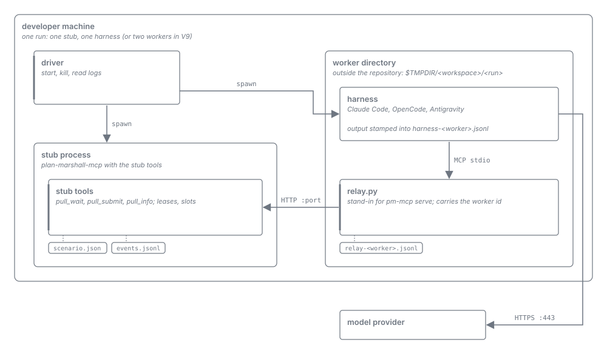

= Evaluation Reference
:toc: left
:toclevels: 3
:toc-title: Table of Contents
:sectnums:
:source-highlighter: highlight.js
:nofooter:

link:../Specification.adoc[Specification] » Evaluation Reference

== Overview

This document records the measurements that substantiate the harness as worker (link:../concepts/harness-as-worker/README.adoc[concept]) and the technical verifications of the native binaries, the job confinement, the credential stores, the host integration, and the git and CI providers (the gates of the link:../Requirements.adoc#_appendix_verification_gates_risk_register_non_normative[Requirements, Appendix: Verification Gates & Risk Register]): what was measured, the result, and which specified value or rule it supports. It is a reference, not a blueprint: it defines nothing, and every normative value lives in its owning specification, which may link here for its evidence. A new measurement updates this document and, where a result changes, the owning specification in the same change.

== Traceability
_See Requirements:_

* _See Requirement link:../Requirements.adoc#PM-WF-5[PM-WF-5: Model Work as Role Tasks & Single-Level Leaf Constraint]_
* _See Requirement link:../Requirements.adoc#PM-WF-8[PM-WF-8: Asynchronous Job Links & Wait Transitions]_
* _See Requirement link:../Requirements.adoc#PM-SEC-1[PM-SEC-1: Two-Boundary Security Model & Untrusted Content Containment]_
* _See Requirement link:../Requirements.adoc#PM-CLIENT-2[PM-CLIENT-2: Data-Driven On-the-Fly Profile Translation]_
* _See Requirement link:../Requirements.adoc#PM-IMPL-4[PM-IMPL-4: Bounded Long-Poll & Progress-Reset Waiting Primitives]_
* _See Requirement link:../Requirements.adoc#PM-WORK-1[PM-WORK-1: Roles as Configuration]_
* _See Requirement link:../Requirements.adoc#PM-WORK-2[PM-WORK-2: Task Protocol]_
* _See Requirement link:../Requirements.adoc#PM-WORK-3[PM-WORK-3: Supervision & Recycling]_
* _See Requirement link:../Requirements.adoc#PM-WORK-4[PM-WORK-4: Consultation through the Server]_
* _See Requirement link:../Requirements.adoc#PM-WORK-5[PM-WORK-5: Interactive Session as Optional Worker]_
* _See Requirement link:../Requirements.adoc#PM-WORK-6[PM-WORK-6: Role Qualification]_

== Status: REFERENCE

== Modules

None: this document records measurements and is not implemented.

[#method]
== Method

The measurements ran in October 2026 against a stub MCP server (experiment-only code, removed after the measurements) with a blocking wait tool, scripted decision tasks, leases per worker generation, and an event log. A driver started the harnesses headless (and, for V10 and E4, interactive) in worker directories outside the repository; each harness reached the stub over `stdio` through a relay standing in for `pm-mcp serve`, which carried the worker's identity and generation so that the model never passed them. A supervisor standing in for the server's job runtime started, watched, recycled, and fenced workers, and a fault injector killed, stalled, and cut workers and relays at chosen events. Every figure comes from the stub's event log, the relay's host-side log, and the arrival-stamped output of the harness, never from what a model reports about itself. Pass criteria were set before the first measured run. Harnesses and models: Claude Code with `claude-haiku-4-5`, OpenCode with `space-bunny-free`, Antigravity with `gemini-3.8-flash-medium`; an item the small model failed was repeated with the next larger model (`claude-sonnet-5-5`, `opencode-go/muse-spark-1.3-contributor`), and open-ended roles ran on Sonnet and Opus. Model judgment (E7 to E9) was measured on 50 fixtures from archived plan-marshall plans and seeded diffs with references the operator confirmed, open answers scored by a zero-tool judge job against listed items.

The technical verifications (the rows named by gate below) ran on 5 and 6 October 2026. Each technique was built in its target module (`pm-api`, `pm-exec`, `pm-core`, `pm-provider-git`, `pm-provider-ci`, `pm-provider-github`, `pm-provider-gitlab`, `pm-relay`, `pm-operator`, `pm-mcp-server`, `pm-e2e`), so every result applies to the product code, not to a stand-in. Integration tests ran against the packaged binaries: the daemon tests start `pm-mcpd` as its own process and reach it over its Unix socket, and the end-to-end tests stage the four binaries as a release layout (with the Netty transport library beside `pm-mcpd`) and drive the real relay `pm-mcp serve`, the launcher `pm-exec`, and real harness CLIs. Every verification test wrote its measured figures to `target/verification-results/` of its module; every figure below comes from there or from the recorded host traffic, the daemon's logs, and the operator's observation where a dialog was involved. Pass criteria were fixed before the first run and not changed by it. The native binaries were built with `-Pnative` on two machines:

* *macOS*: macOS (Darwin 25.6) on `arm64`; GraalVM CE 25.0.4.1.1 (release `graal-25.4.4.1.1`), Temurin 25.0.1 for the JVM runs; `quarkus-mcp-server` 2.0.2.
* *Linux*: Ubuntu 26.04.1 LTS, kernel `7.0.0-34-generic`, `x86_64`, Intel Core i5-1340P (16 logical CPUs), 30 GB RAM; glibc 2.43; Landlock ABI 8; GraalVM CE 25.4.4.1.1 (`native-image` 25.0.4.1.1); Maven 3.9.16; Docker Engine 29.8.2 with Compose v5.6.0; Gradle 9.6.1; mvnd 1.0.6; a headless `gnome-keyring` 50.0 in a private `dbus-run-session`. The machine was a shared workstation; the startup figures were taken with its other sessions idle.

Harnesses: Claude Code 2.1.291 with `claude-haiku-4-5`, OpenCode 1.18.34 (with `opencode-go/muse-spark-1.3-contributor` on Linux), Antigravity 1.3.0 with `gpt-oss-120b-medium` (its Gemini model was out of quota), and the Antigravity CLI `agy` 1.2.16 for the host facts. Codex was not installed. The provider tests (opt-in, each run twice with identical results) used fixture repositories: the public GitHub repository `cuioss/pm-mcp-fixture` with a trivial `ci` workflow on `push`, `pull_request`, and `merge_group`, covered by the organisation's review bots CodeRabbit, Sourcery, and `cuioss-review-bot`; a GitHub App installed on that repository only, with exactly the seven repository permissions the credential specification allows; and the public GitLab project `cuioss/pm-mcp-fixture` with a trivial pipeline, reached with the operator's `glab` login. The migration inventory was taken from `plan-marshall` at commit `b3aba30aa9a49cc0f1fd426db145fea20d95f350`.

[#results]
== Results

[cols="1,3,4,3", options="header"]
|===
|Item |Question |Result |Substantiates

|V1
|How long does a host hold one blocking tool call, with and without progress?
|Claude Code ends a call after 1800 s of silence and holds it while progress arrives; OpenCode ends a silent call after 60 s and holds it with a frame every 5 s (≥ 3600 s); Antigravity ends every call after 180 s, progress has no effect.
|Bounded wait and `progress_resets_timeout` per host (<<parameters>>; link:client-profiles/01-profile-schema.adoc[Client Profiles]).

|V2
|Does a headless worker hold the wait loop?
|240 of 240 waits on Claude Code (three runs) and Antigravity; the OpenCode model gave up twice in short empty waits.
|Supervision and the idle recycle; held waits (link:timeouts/01-job-budgets-and-waits.adoc#bounded-wait[Bounded Wait]).

|V3
|Do warm and fresh workers decide alike, and how long does a warm loop last?
|100 % correct in both forms on all hosts; the warm loop broke at 135k to 150k tokens on Haiku (Sonnet held to 787k, OpenCode to 336k).
|The token budget per role below the break point.

|V4
|Can a headless worker be ended and resumed?
|Ends within 1 s of `SIGTERM` without orphans; a stored session resumes in 3 to 13 s; a terminated session reports no usage.
|Ending by `SIGTERM`, then `SIGKILL`; the usage of a killed worker is unmeasured.

|V5
|What does a fresh job for one decision cost?
|Median 8.8 s and 0.02 USD on Claude Code (21.0 s, 0.06 USD with a cold provider cache), 11.3 s on OpenCode, 16.8 s on Antigravity.
|A fresh job as the default form (link:../Requirements.adoc#PM-WF-5[PM-WF-5]).

|V6
|What does a warm worker cost while idle?
|About a tenth of the context per wake-up (3,756 priced units at 35k, 10,922 at 105k).
|The idle recycle.

|V7
|Is usage attributable per task?
|Claude Code and OpenCode report all four token components per turn; Antigravity reports no cache-creation figure.
|Usage per task; Antigravity usage unmeasured.

|V8
|Does injected text carry over to later tasks of a warm decision worker?
|Never, in 65 warm runs of decision workers with five variants; in three runs it changed the decision of the task that carried it. The screener's carry-over is measured in E9.
|Screening before delivery (link:model-work/07-untrusted-text-screening.adoc#two-level-guard[Two-Level Guard]); no recycle after untrusted text.

|V9
|Is a killed worker's task redelivered exactly once, and is the tool set fixed?
|30 of 30 redelivered exactly once on Claude Code and OpenCode, no duplicate submit; a tool added mid-run was not callable; not possible on Antigravity with its one global entry.
|Leases per generation; the fixed tool set of a worker.

|V10
|Can the interactive session drive the loop?
|No: Claude Code paused itself for up to 30 minutes and queued the operator's input; OpenCode stopped after 58 cycles and asked the operator.
|The session is entry and viewer, never a driver.

|E1
|Does an acknowledgement separate a live worker from a lost one?
|Claude Code p99.9 6.4 s explicit, 2.8 s implicit; OpenCode: a provider stall of 120.8 s left a live worker's task unacknowledged.
|The explicit acknowledgement; the deadline per host, informational on OpenCode (<<parameters>>).

|E2
|Are lost workers detected, replaced, and fenced?
|Passed on all three hosts, six faults, ten trials each: exit detected within about 1 s, a stall by silence within its deadline and never earlier, the lease released at the fence, every late submit of a replaced generation refused.
|Detection, fencing, immediate lease release; the silence grace of 30 s.

|E3
|Do idle and budget recycling keep workers alive over hours of sparse work?
|Passed on Claude Code and OpenCode over four hours: no worker stopped on its own; the longest wait of a due task 5.0 s and 23.8 s; the budget recycled Haiku at 83k tokens.
|Idle recycle and token budget (<<parameters>>).

|E4
|Can the interactive session take tasks beside a headless fallback?
|Every task taken once; the session took 15 of 16 (Claude Code) and 16 of 16 (OpenCode). On OpenCode the reply to the operator waits for the end of the loop, `/new` leaves the old loop running, and two loops under one identity each receive every task.
|The session as optional worker with a new generation per session start (<<limits>>).

|E5
|Can a worker consult another role through the server?
|100 consultations, each answered once and delivered to the right asker, on the same and across hosts; the longest (286 s) was covered by progress. Haiku broke its own submit call in one session.
|Consultation as a task; every submit validated against its link's schema.

|E6
|Can several Antigravity jobs run behind its one global entry?
|Two jobs bound correctly with the identity from the environment; four jobs and long waits not measured.
|Antigravity not worker-eligible until measured (<<limits>>).

|E7
|Do the model roles decide real cases at the operator's level?
|Judged against an agreement level of 80 % (model verification corpus README); the allowed warm-fresh gap used is not recorded, and the verdict holds for any allowed gap below 37 points. Security, simplify, and both self-reviews: 100 %, warm and fresh. Sonar triage 87.5 % fresh (warm on the small model 50 %). PR comment triage 80 to 90 %. Build and CI triage 62.5 to 75 %, re-planning 60 to 74 %: below the level on every model.
|Role qualification; the conservative fallback for unqualified roles (<<limits>>).

|E8
|Does every role run where its configuration puts it?
|16 of 16 tasks on the configured harness, model, and effort, no tool outside a role's set; moving roles between harnesses was a change of the configuration set.
|Roles as configuration with one model caller.

|E9
|Which screener form catches injected text?
|Both forms flagged 15 of 15 injections; after level 1 removed review-bot boilerplate, the fresh zero-tool job had 3.3 % false positives at 0.018 USD and 7 s per verdict; the warm screener carried injected text over and changed a later verdict.
|The screener as a fresh zero-tool job after level 1 (<<parameters>>).

|E13
|Do server-delivered skills bind every worker?
|The skill rule followed in 100 % of the decisions in every delivery form, 0 % in the control; re-delivered after every new generation, reported compaction, and changed digest. A cleared interactive session read a skill named by URI through `pm_skill`.
|Skill delivery per generation and the shim (link:mcp-tools/02-service-and-skill-tools.adoc[Skill Tools]).

|Gate 1: local adapter under native image
|Does the native `pm-mcpd` serve MCP and `/api/v1` on its Unix socket with runtime-token authentication and unbuffered SSE, recover a stale socket, refuse an over-long socket path, and carry `cui-http` and `commonmark`?
|Pass on macOS and Linux: socket `0600` in a `0700` `run/`; `401` without or with a wrong token; the first SSE event arrives before the stream ends; a second runtime exits `0` with the base byte-identical; the next start after `kill -9` removes the stale socket and serves; a 143-byte socket path exits `77` and writes nothing; the ingestion validator works natively. Vert.x binds the socket under the process `umask` (`0755`), so the runtime restricts it to `0600` before writing `runtime.json`; Quarkus replaces the native transport by the JDK transport in a native image, so `pm-mcpd` offers kqueue and epoll itself with their JNI metadata; authentication is inert without the `quarkus-security` extension.
|link:../Requirements.adoc#PM-TECH-1[PM-TECH-1], link:../Requirements.adoc#PM-SEC-4[PM-SEC-4]; link:runtime-model/01-processes-and-transport.adoc#local-api[Local API].

|Gate 1: startup and memory bounds
|Does the native runtime meet the startup and memory bounds on both platforms?
|Pass on both with the Netty transport library beside `pm-mcpd`: cold start median 41.4 ms (macOS) and 26.9 ms (Linux) against 50 ms; idle RSS 40.5 MB and 49.3 MB against 64 MB; relay `initialize` forwarded in 13.5 ms and 7.0 ms; `pm-operator` first request in 14.8 ms and 14.4 ms. Without the library beside the binary Netty extracts it into the temporary directory on every start and executes it from there: 292 ms cold start on macOS (fail), within the noise on Linux. Under a load average of about 30 the Linux cold-start median was 55.2 ms.
|link:../Requirements.adoc#PM-TECH-3[PM-TECH-3]; link:cli-and-security/01-cli-and-installer.adoc#installation-layout[Installation Layout] (<<parameters>>).

|Gate 1: client stack under native image
|Do `pm-mcp` and `pm-operator` work as plain native images, including the relay's forwarding?
|Pass on both: `stdout` of the relay carries only newline-framed JSON-RPC, the relay ends 0 to 1 ms after `stdin` EOF and refuses to run inside a worker without `--job`; `pm-operator status` writes nothing while no runtime runs; SSE events reach the client output within 1 ms.
|link:../Requirements.adoc#PM-TECH-3[PM-TECH-3]; link:runtime-model/03-relay.adoc#relay-rules[Relay Rules].

|Gate 8: detached on-demand start
|Do `pm-mcp` and `pm-operator` start `pm-mcpd` detached, so that a termination of the relay never reaches it?
|Pass on both: FFM `posix_spawn` with `POSIX_SPAWN_SETSID` (`0x0400` on macOS, `0x80` on glibc) works in the native image; the daemon's pid equals its process-group id (and session id on Linux), `stdin` is `/dev/null`, `stdout` and `stderr` are appended to `logs/daemon.log`; it survives `kill -9` of the relay and `SIGHUP` to the relay's process group, re-parented to pid 1, with no zombie left.
|link:../Requirements.adoc#PM-ARCH-7[PM-ARCH-7]; link:cli-and-security/01-cli-and-installer.adoc#cli-daemon-access[Runtime Access & On-Demand Start].

|Gate 15: web listener at runtime
|Can a second listener be opened and closed while the runtime runs, with its own routes and token kind?
|Pass on both: it opens in 3 to 4 ms and closes in 0 to 2 ms while an SSE stream on the socket keeps delivering (30 of 30 events without a gap across four toggles); `/mcp` gives `404` and the runtime token `401` there; loopback mode binds `127.0.0.1:7420` only, LAN mode serves TLS with an ECDSA P-256 certificate (`SHA256withECDSA`) written by an own DER encoder. The second server reaches the shared router and security chain by delegating `/api/v1/` to Quarkus' root handler, an internal API.
|link:../Requirements.adoc#PM-SEC-7[PM-SEC-7]; link:cli-and-security/03-web-server.adoc#web-server-lifecycle[Web Server Lifecycle].

|Gate 4: macOS Keychain from the native binary
|Does the native `pm-mcpd` store items in the login keychain through FFM, readable without a prompt only by itself?
|Pass: put, get, and delete through `SecItem*` take 40.5, 2.8, and 16.0 ms natively; the default ACL trusts exactly the creating binary; another reader raises the OS access dialog (allow grants once and leaves the ACL unchanged, deny refuses), while `pm-mcpd` reads without a prompt. An ad-hoc-signed binary is trusted by its code-directory hash, so a rebuild or upgrade loses unprompted access to its items; stable trust needs a Developer ID signature. The data-protection keychain refuses an unentitled binary (`errSecMissingEntitlement`).
|link:../Requirements.adoc#PM-CRED-2[PM-CRED-2].

|Gate 5: Linux Secret Service over D-Bus
|Does the native `pm-mcpd` use `org.freedesktop.secrets` over the JDK Unix-domain channel, and fall back without prompting or hanging?
|Pass: native put, get, and delete take 16.5, 1.7, and 4.7 ms (SASL `EXTERNAL`, `plain` session, default collection); the item is visible to `secret-tool` with its `service` and `credential_key` attributes. With the collection locked, and without a session bus, the runtime starts with the file store in 92 to 97 ms, logs `PM_MCP-130`, never prompts, and writes `0600` files in a `0700` directory. Both session buses seen used path addresses. A job's reach to the session bus (Landlock ABI 8): a confined job whose read set denies the runtime directory still connects to the real bus socket `/run/user/<uid>/bus` and gets its `ListNames` answered, because Landlock governs a connect to a pathname socket only from ABI 9; without `DBUS_SESSION_BUS_ADDRESS` alone a client still finds the bus through `$XDG_RUNTIME_DIR/bus`, and with both variables withheld a client that looks the bus up no longer finds it, while a connect that names the path still succeeds. The job environment built by the launcher carries no `DBUS_SESSION_BUS_ADDRESS`, and a socket under a read rule or in the write set stays connectable. On a headless machine the D-Bus-activated keyring keeps its login collection locked, so the file store serves there.
|link:../Requirements.adoc#PM-CRED-2[PM-CRED-2], link:../Requirements.adoc#PM-CRED-3[PM-CRED-3], link:../Requirements.adoc#PM-SEC-5[PM-SEC-5]; link:job-runtime/02-confinement-and-environment.adoc[Confinement and Environment].

|Gate 2: LSP4J and JGit under native image
|Do LSP4J's JSON-RPC proxies and JGit work in the native `pm-mcpd`, and what does JGit cost?
|Pass on both: LSP `initialize` and `definition` take 329 and 6 ms (macOS) and 1145 and 20 ms (Linux), `initialize` including the start of the fixture server's JVM; the reachability metadata registers LSP4J's `[interface, Endpoint]` proxies and initialises JGit at run time. The 12-step JGit scenario passes in 360 ms (macOS; JVM 1151 ms) and 61 ms (Linux), the hook commit refused with `CAPABILITY_MISSING`; linked worktrees written natively are read correctly by `git worktree list`. Plain JGit with own metadata serves instead of a Quarkus extension. The idle RSS grows from 50.9 MB to 62.5 MB after one scenario and 67.5 MB after a second (Linux).
|link:../Requirements.adoc#PM-TECH-2[PM-TECH-2], link:../Requirements.adoc#PM-EXEC-5[PM-EXEC-5].

|Gate 6: STDIO test harness
|Does the `quarkus-mcp-server-test` STDIO client drive the relay in front of the packaged daemon?
|Pass on both, in the JVM and the native layout: `McpAssured.newStdioClient()` (2.0.2) launches `pm-mcp serve` in front of the staged daemon and completes `initialize` (`2025-11-25`), `tools/list` (the ten core tools), and a call; connect takes 181 to 759 ms natively. The client waits at most 10 s per response and has no setter for it, so a test starts the daemon before the relay.
|link:../Requirements.adoc#PM-TEST-3[PM-TEST-3].

|Gate 10: sessionless Streamable HTTP
|Does `quarkus-mcp-server` serve both host protocol forms without MCP sessions, with the connection headers reaching the tool handler?
|Pass on 2.0.2 (macOS, native): `2026-07-28` is served sessionless through `server/discover` with the protocol data in `_meta` (without it `400`); `initialize` (`2025-11-25`) always issues `Mcp-Session-Id`, which a filter strips, and later requests are served by automatic initialisation; the `PM-MCP-*` headers reach the handler through the security identity; progress arrives on the call's own SSE stream. Elicitation in `2026-07-28` is an `input_required` result answered by a retry with `inputResponses`, not a request from the server. The server advertises `tools.listChanged` and holds `subscriptions/listen` open for the whole session, with no setting to turn either off. Claude Code blocks its start for 27 s on an unanswered listen; refused with `-32601` it lists tools at once, retries the listen three times (+1, +3, +7 s), and stops.
|link:../Requirements.adoc#PM-TECH-1[PM-TECH-1], link:../Requirements.adoc#PM-SKILL-2[PM-SKILL-2]; link:runtime-model/03-relay.adoc#relay-rules[Relay Rules].

|Gate 11: flat tool schemas
|Are the final flat schemas of the core tools registered and callable on every host?
|Pass on Claude Code, OpenCode, and Antigravity (native layout): ten of ten core tools listed and each called successfully, no schema rejected; two Antigravity calls needed a second session after the model ended without making them. OpenCode connects with `initialize` (`2025-11-25`), Claude Code and Antigravity with `server/discover` (`2026-07-28`). Codex not run.
|link:../Requirements.adoc#PM-TOOL-5[PM-TOOL-5].

|MCP skills extension
|Does a host list and load a skill through the MCP skills extension?
|Not run: the extension needs `quarkus-mcp-server` 2.1, which was not released; the tool mirror and the `skill://` resources serve alone.
|link:mcp-tools/02-service-and-skill-tools.adoc#skills-extension[Skills Extension].

|Gate 12: TOON specification pin
|Does the encoder pass the conformance fixtures of the current official TOON version?
|Pinned to TOON v4.1, release v4.1.3 (commit `a6b801a3326980ab2cb615b0ffe44457e091f7b6`). Of 185 encode fixtures 23 use encoder options that are not offered (another delimiter, another indentation). An encoder limited to hand-picked forms passed 114 and could not encode 48: the official rules have no trailing newline (§12), write an empty array as `key: []` (§9.1), escape C0 controls as `\u00XX` and leave DEL unquoted (§7.1), and require the keyed tabular form for a map of uniform objects (§9.5), field groups for nested uniform columns, and the list form for non-uniform arrays. The full encoder of the official rules passes all 162 byte-exact.
|link:../Requirements.adoc#PM-IMPL-3[PM-IMPL-3]; link:hypermedia-format/03-composite-wait-and-encoder.adoc[TOON Encoder].

|Gate 14: host facts
|Are the provisional host integration values, identity probes, and nested-host markers right?
|Captured at `initialize` by a logging MCP server (Claude Code, OpenCode, Antigravity) and from documentation and source (Codex). Confirmed: Claude Code sets `CLAUDE_CODE_SESSION_ID` (equal to the session id) and `CLAUDECODE=1`, `clientInfo.name` `claude-code`; OpenCode sets `OPENCODE`, `OPENCODE_PID`, and `AGENT=1` but no session variable, `clientInfo.name` `opencode`; Antigravity reads `~/.gemini/config/mcp_config.json`; no host passes its model in the environment. Corrected: Antigravity has a project configuration `.agents/mcp_config.json` and a version probe (`agy --version`); Codex reports `codex-mcp-client` and passes only a fixed variable list to MCP servers, so its markers reach `pm-mcp enter` but never `pm-mcp serve`; OpenCode's command directories are plural; Codex skills live in `.agents/skills/`; version patterns per host. Claude Code inside OpenCode is attributed to OpenCode by the fixed precedence; only Claude Code sets `AI_AGENT`, and an inherited value survives into a nested host. `.agents/skills` is read by Codex, Antigravity, and OpenCode.
|link:client-profiles/02-placeholders-and-detection.adoc#host-integration-table[Host Integration Table], link:client-profiles/02-placeholders-and-detection.adoc#host-identity-probes[Host Identity Probes].

|Gate 9: relay start and termination
|Does each host start the relay from its MCP configuration and end it with the session, leaving the runtime running?
|Pass on Claude Code, OpenCode, and Antigravity (native, macOS): the relay is a child of the host and up 0.8 to 1.5 s after the host starts; after a normal end and after `SIGTERM` to the host the relay is gone within 60 ms and the runtime keeps answering. Codex, with its call idle timeout, not run.
|link:../Requirements.adoc#PM-ARCH-7[PM-ARCH-7]; link:runtime-model/03-relay.adoc[Relay].

|Gate 13: headless Claude Code and OpenCode
|Does a worker of each harness complete a task through `pm-exec` and `pm-mcp serve --job`, confined on Linux, with its own login, and which paths, outputs, and input sizes does it need?
|Claude Code passes on both platforms; OpenCode passes up to its tool-result limit, on Linux with a data directory per worker. Every worker reached the runtime from inside `pm-exec` (confined, Landlock ABI 8, on Linux), used the harness's own login, produced structured output that parses with its usage fields, and exited on `SIGTERM` during a held wait without an orphaned relay. Claude Code completed task inputs of 8,000, 32,000, and 128,000 characters; OpenCode completed 32,000 and failed at 128,000: it truncates every tool result above its limit, stores the full text in its own data directory, which a worker restricted to the server's tools cannot read, and the truncated wait answer lost its task id, so every guessed id was refused and nothing was acknowledged wrongly. OpenCode loads a native library from `/tmp`. With a data directory per worker (its own `XDG_DATA_HOME` in the worker directory, holding a copy of the operator's login `auth.json` with mode `0600` that is removed when the worker ends), OpenCode passes confined and natively on Linux: task inputs of 8,000 and 32,000 characters completed in 8.0 and 10.8 s (base task 9.3 s), exit 36 ms after `SIGTERM`; it wrote its database and log into the worker directory and its native library to `/tmp`, and nothing below `~/.local/share/opencode`, `~/.config/opencode`, `~/.cache/opencode`, or `~/.local/state/opencode`; the operator's database was unchanged and no login copy was left. Resource tools were not exercised.
|link:client-profiles/01-profile-schema.adoc#headless-block[Headless Block], link:client-profiles/01-profile-schema.adoc#headless-writable-paths[Writable Paths]; link:timeouts/03-retention-host-config.adoc#size-limits[Worker Input Size Limits] (<<parameters>>).

|Gates 9 and 13: Codex
|Do the Codex headless capabilities hold, and what is its MCP call idle timeout?
|Not run (<<limits>>).
|The Codex profile values stay provisional.

|Gate 3: Landlock confinement against real builds
|Does the Landlock ruleset of the native `pm-exec` confine jobs while real builds succeed with the declared write set?
|Pass on Linux: `pm-exec --probe` reports ABI 8, `no_new_privs`, `confined` in 5 ms; natively, writes and reads of the base are denied, a write into another project denied and into the own project allowed, a sibling of the base readable, a job-private directory read-only, a missing program exits `127`. The Maven wrapper (12.8 s), mvnd (14 s cold, 10 s warm), Gradle (15.5 s cold, 0.67 s warm), Testcontainers, and Docker Compose succeed with the declared write set and no extra path. Listing `/` and `$HOME` is denied as a side effect of the read set; no build needed it. Outside the criterion: a build daemon started unconfined serves a confined client over loopback TCP and writes outside the client's write set (mvnd and Gradle); a daemon started confined keeps the first job's ruleset and fails a later client with another write set; and the Docker socket is reachable under Landlock, which does not govern `connect` on a pathname socket, so a container started through `pm-exec` read the runtime token file from a bind mount.
|link:../Requirements.adoc#PM-SEC-5[PM-SEC-5]; link:job-runtime/02-confinement-and-environment.adoc[Linux Filesystem Confinement].

|Gate 16: worker supervision under target conditions
|Does the fault matrix of E2 hold against the real relay with confined writer workers?
|Claude Code passes (native, Linux, six faults with ten trials each, 28 minutes): every task submitted exactly once; exit detected after 205 to 302 ms; a stall detected by silence after 50.0 to 50.1 s (wait 20 s plus grace 30 s) and never earlier; every late call of a replaced generation refused. OpenCode with a data directory per worker meets every criterion in all six faults (native, Linux, ten trials each, 35 minutes): every task submitted exactly once; exit detected after 205 to 304 ms; a stall longer than the silence limit detected after 50.0 to 50.1 s and never earlier, with no start failure of another worker; every late call of a replaced generation refused; no login copy left after 73 worker generations. The integration test of that run failed on one trial: it recorded the stall shorter than the silence limit as 9 of 10. One worker, stopped for 16 s directly after it had opened a model request, never continued after it was resumed, and was replaced by silence after 50.0 s, at its deadline and not before it; its task was submitted exactly once by the replacement. The test's evaluator failed every replacement of a briefly stalled worker, which is stricter than the criterion (no stalled-but-alive worker is replaced before its deadline); with the evaluator corrected to the criterion, the recorded logs of that cell evaluate to 10 of 10. The matrix was not run again, so this verdict is a re-evaluation of the recorded run. With the per-user database all OpenCode processes share by default, the long stall fails: the stopped worker blocked the database, the next three generations of the other worker exited at start on a failed database write, and the start-failure guard ended the run before the stalled worker's deadline. Outside the criterion: a supervisor killed from outside leaves the login copies of its live workers behind.
|link:../Requirements.adoc#PM-WORK-3[PM-WORK-3]; link:model-work/03-supervision-and-recycling.adoc#detection[Detection], link:model-work/03-supervision-and-recycling.adoc#start-failure-guard[Start-Failure Guard]; link:job-runtime/02-confinement-and-environment.adoc#worker-data-home[Per-Worker Data Home].

|Native git against a real remote
|Do the JGit operations work against a GitHub repository with App installation tokens?
|Pass (JVM, two runs): fetch with a `contents: read` token (808 ms); a linked worktree on a new branch, commit, and push (1,406 ms); a push with a stale lease rejected and with the right lease accepted (1,286 ms); log, `worktree-sha` (7 ms), worktree list and removal; a push to a remote of another origin refused (`REMOTE_ORIGIN_MISMATCH`). Init, a configured remote, and fetch serve in place of a clone.
|link:../Requirements.adoc#PM-EXEC-5[PM-EXEC-5].

|Review-bot triggers and pull-request authorship
|Does each review bot answer a trigger posted by the GitHub App, and on which identity does a review depend?
|Fail with installation tokens: on pull requests the App authored, CodeRabbit posted a skip notice for a bot user within 9 s and ignored the App's trigger; Sourcery reviewed on its own about 40 s after opening; `cuioss-review-bot` stayed silent (15-minute bound). With a GitHub App user access token (device flow, acting as the operator through the App) CodeRabbit reviewed on its own 15 s after opening and accepted the trigger; the push and the pull request triggered CI as the operator, and every operation of the permission set succeeded, with the rights the intersection of the App's and the operator's. A pull request the App authored and the user token triggered was still skipped: the author decides. The token refresh works without the client secret; both tokens rotate on every refresh and the old access token is revoked at once.
|link:phase-workflows/05-finalize-review-metrics-descriptor.adoc#automatic-review[Automatic Review]; link:../Requirements.adoc#PM-CRED-1[PM-CRED-1], link:cli-and-security/02-credentials-and-operator.adoc#derived-tokens[Derived Tokens] (<<parameters>>).

|CI triggered by App pushes
|Do a push and a pull request made with an App installation token trigger the repository's workflows?
|Pass: two pushes and a pull request triggered the `ci` workflow for `push` and `pull_request`, with the App's bot user as actor.
|link:cli-and-security/02-credentials-and-operator.adoc#agent-credentials[Agent Credentials].

|GitHub App permission set
|Does the App's permission set suffice for every operation, with no wider permission?
|Pass: the installation holds exactly the seven repository permissions, and a token asking for `administration: read` is refused (`422`). With tokens narrowed per operation every operation succeeds: push (`contents: write`); pull-request creation and pull-request comment (`pull_requests: write`; `issues: write` alone gets `403`); review comment, review-thread list and resolve over GraphQL; checks, statuses, and actions reads; branch deletion. The merge-queue enqueue answered that the branch has no queue (the fixture has none; not a permission error). GitHub hands out App keys in PKCS#1, which the JWT signer did not read.
|link:cli-and-security/02-credentials-and-operator.adoc#agent-credentials[Agent Credentials].

|GitLab thin client against a real project
|Do the GitLab operations work against a GitLab project?
|Fail for the token identity only: discussions list, reply, and resolve, a job trace (6,558 characters), and a merge with `sha` succeed; adding to a merge train answers `400` (not enabled on the free plan); the personal-access-token identity endpoint refuses the OAuth token of a `glab` login with `400`; a `400` refusal was mapped to a failure instead of a rejection. `glab` 1.120.0 has no command that prints the token (`glab config get token` does).
|link:../Requirements.adoc#PM-EXEC-5[PM-EXEC-5].

|`glab` bodies on `stdin`
|Does each `glab` form that takes a body read it from `stdin`?
|Pass: `glab api … --input -` reads the body from `stdin` for merge-request creation, note reply, and merge (a wrong `sha` gets `409`, the right one merges); every form without a body works. The merge-train answer does not depend on the body and decides nothing about `stdin`.
|link:../Requirements.adoc#PM-EXEC-5[PM-EXEC-5]; link:cli-and-security/02-credentials-and-operator.adoc#cli-variant-credentials[CLI Variant Credentials].

|Migration inventory
|Is every `plan-marshall` script classified with a reason?
|444 scripts at the pinned commit, each with exactly one disposition and a reason, without duplicates: 44 `Ported`, 252 `Redesigned`, 148 `Retired` (link:../roadmap/migration-inventory.csv[migration inventory]). The ported scope is wider than the classification matrix (13 build and coverage output parsers among them); the pure git and CI parsers sit inside verb scripts classified `Redesigned`, so the differential corpus is cut at function level.
|link:../Requirements.adoc#PM-TEST-1[PM-TEST-1], link:../Requirements.adoc#PM-TEST-2[PM-TEST-2].
|===

[#parameters]
== Substantiated Values

The values below are the measured basis of the client profile's worker parameters, the screener, the runtime bounds, the job confinement, and the provider credentials. Their normative home is the owning specification; these tables hold their evidence.

[#worker-parameters]
=== Worker Parameters per Host

[cols="3,2,2,2,3", options="header"]
|===
|Value |Claude Code |OpenCode |Antigravity |Evidence

|Bounded wait (s)
|240
|240, with progress frames
|150
|V1; E3 (longest due-task wait 5.0 s, 23.8 s)

|Progress resets the host timeout
|yes
|yes
|no
|V1

|Acknowledgement deadline (s)
|15 (p99.9 6.4 s, longest stall 5.9 s)
|270, equal to the silence limit; the acknowledgement is informational
|30 (extrapolated from 100 tasks: p99.9 15.9 s)
|E1

|Silence: bounded wait plus grace (s)
|240 + 30
|240 + 30
|150 + 30
|E2

|Idle recycle
|after 3 wake-ups without a task
|after 3 wake-ups
|after 3 wake-ups (extrapolated)
|V2, V6, E3

|Token budget, small model
|80k (recycled at 83k, break at 135k)
|80k (recycled at 81k)
|80k (extrapolated)
|V3, E3
|===

* *Start context*: a fresh worker starts with about 47k tokens on Claude Code with Haiku, 27k on Antigravity, and 5k on OpenCode; a token budget therefore depends on harness and model, and a generation serves at least one task before the budget can recycle it.
* *Screener*: level 1 removes collapsed sections, HTML comments, and the known disclosure footers of review bots before the screener sees the text (without that, 23 to 27 % false positives on real review comments); level 2 is a fresh zero-tool job (E9).
* *Start failures*: an account at its usage limit makes every worker exit before its first call; without a guard the supervisor replaced workers more than 200 times. Exits before the first call are start failures, and replacement stops after a few (first measurement round).

[#platform-values]
=== Runtime per Platform

Native binaries in the staged release layout, with the Netty transport library beside `pm-mcpd`; medians with minimum and maximum. The bounds are those of link:../Requirements.adoc#PM-TECH-3[PM-TECH-3].

[cols="3,2,2,1,2", options="header"]
|===
|Value |macOS `arm64` |Linux `x86_64` |Bound |Evidence

|`pm-mcpd` cold start to ready, 20 starts (ms)
|41.4 (40.0 to 56.2)
|26.9 (21.1 to 33.6); 55.2 under a load average of about 30
|50
|Gate 1 bounds

|Cold start with the Netty library extracted to the temporary directory (ms)
|292
|68 against 72 with the library beside the binary (shell loop with polling, within noise)
|—
|Gate 1 bounds

|`pm-mcpd` idle RSS 10 s after ready (MB)
|40.5
|49.3
|64
|Gate 1 bounds

|`pm-mcpd` idle RSS after one and two JGit scenarios (MB)
|not measured
|62.5, 67.5 (from 50.9 before)
|—
|Gate 2

|`pm-mcp serve` forwards `initialize`, 15 runs (ms)
|13.5 (11.9 to 15.4)
|7.0 (5.5 to 8.0)
|50
|Gate 1 bounds

|`pm-operator` first request, 15 runs (ms)
|14.8 (13.4 to 22.9)
|14.4 (11.8 to 22.5)
|50
|Gate 1 bounds

|Binary size: `pm-mcpd`, `pm-mcp`, `pm-operator`, `pm-exec`
|61.7 MB, about 17 MB, about 17 MB, 12.6 MB
|62.3 MiB, 17.2 MiB, 17.3 MiB, 12.4 MiB
|—
|Gate 1 bounds

|Native build time
|not recorded
|`pm-mcpd` 1 min 23 s alone; full native build with all integration tests 7 min 12 s
|—
|Gate 1 bounds

|Landlock ABI
|no Landlock (jobs unconfined)
|8 (`pm-exec --probe` in 5 ms)
|≥ 2
|Gate 3

|OS keyring put, get, delete, native (ms)
|40.5, 2.8, 16.0 (Keychain)
|16.5, 1.7, 4.7 (Secret Service)
|—
|Gates 4, 5

|Web listener open, close (ms)
|3, 0
|4, 2
|—
|Gate 15
|===

[#host-values]
=== Hosts as Relay Starters and Workers

[cols="3,2,2,2,2", options="header"]
|===
|Value |Claude Code |OpenCode |Antigravity |Evidence

|Protocol form at connect
|`server/discover` (`2026-07-28`)
|`initialize` (`2025-11-25`)
|`server/discover` (`2026-07-28`)
|Gate 11

|Relay up after the host starts (s)
|1.1
|1.5
|0.8
|Gate 9

|Relay gone after the host ends, normally / on `SIGTERM` (ms)
|≤ 54 / ≤ 51 (host exits 2,813 ms after `SIGTERM`)
|≤ 52 / ≤ 56 (host exits after 21 ms)
|≤ 60 / ≤ 54 (host exits after 321 ms)
|Gate 9

|Worker exit on `SIGTERM` during a held wait (ms)
|2,604 (macOS), 601 (Linux)
|19 (macOS), 36 to 43 (Linux)
|not measured
|Gate 13

|Exit of a worker detected by the supervisor (ms)
|205 to 302
|205 to 304
|not measured
|Gate 16 (E2: about 1 s)

|Stall detected by silence, wait 20 s plus grace 30 s (s)
|50.0 to 50.1
|50.0 to 50.1
|not measured
|Gate 16

|Largest task input completed (characters, of 8,000 / 32,000 / 128,000)
|128,000
|32,000
|not measured
|Gate 13
|===

* *OpenCode per-tool-result limit*: OpenCode truncates every MCP tool result above a limit that lies between 32,000 and 128,000 characters (the exact threshold is not measured) and stores the full text in `~/.local/share/opencode/tool-output/`; the worker input size limit of an OpenCode worker lies below it (Gate 13). With a data directory per worker that text lies in the worker directory.
* *Writable paths under Landlock* (Linux, Gate 13): Claude Code needs `~/.claude`, the file `~/.claude.json` (not `$HOME` itself), `~/.cache/claude`, `~/.cache/claude-cli-nodejs`, `~/.local/state/claude`, and `~/.local/share/claude`; OpenCode with a data directory per worker was given the worker directory (which holds the data directory: `opencode.db`, `log/`, `tool-output/`), `~/.local/state/opencode`, and `~/.cache/opencode`, and wrote only the worker directory and `/tmp`: the two home paths were declared and not exercised; `~/.local/share/opencode` and `~/.config/opencode` are then not writable. With the shared data directory OpenCode needs all four home paths. Both harnesses need the workspace, `/tmp`, and `/dev`. Session residue: a Claude Code transcript under `~/.claude/projects/<workspace>/`; for OpenCode its database `opencode.db`, which by default is one per user that all OpenCode processes of the user share (Gate 16).
* *OpenCode after a short stop*: an OpenCode process stopped while a model request is open may never continue after it is resumed (1 of 20 trials with a 16 s stop); the hung process stays alive and silent, so it costs one silence limit (50 s in the run) before its task is given to a replacement. OpenCode has no timeout on its model request that would end it earlier (Gate 16).
* *Usage of one headless task* (Gate 13): Claude Code with `claude-haiku-4-5` 0.08 to 0.12 USD per task with 24k to 31k cache-creation tokens; OpenCode reports input, output, cache read, cache write, and reasoning tokens.

[#provider-values]
=== Provider Tokens and Allowances

* *GitHub App installation token*: valid one hour (fixed by GitHub, not measured), minted per operation and narrowed to the repository and the operation's permissions (permission set row).
* *GitHub App user access token*: valid 8 hours; its refresh token about 6 months. Both rotate on every refresh, the old access token is revoked at once, and the refresh needs no client secret (review-bot row).
* *CodeRabbit allowance*: one included review per hour for the fixture organisation (review-bot row).
* *App key format*: GitHub hands out the App's private key in PKCS#1 (permission set row).

[#limits]
== Limits

* *Antigravity is extrapolated*: its quota ran out during the first measurement round. Detection and fencing (E2) are measured; its acknowledgement latency under load, recycling over hours, consultation, skill delivery, and several concurrent jobs (E6) are extrapolated from smoke runs. It is not eligible as a worker host until measured. Codex was not measured.
* *Build and CI triage and re-planning are not qualified* (E7) on any model tried. The workers had 14- to 17-line role contracts instead of plan-marshall's triage extensions, triage standards, and outline and planning guidance, so the result bounds what such contracts achieve, not what the roles can reach. These roles fall back to the conservative server behaviour until a configuration qualifies.
* *A warm worker can drift* where a fresh job does not (Sonar triage on the small model, E7); warm is chosen per role only within the allowed gap to fresh.
* *Facts decide*: every model decided a case wrongly whose facts lacked the evidence its reference rests on, and rightly once it was added (E7).
* *The interactive session on OpenCode* keeps its loop in one turn, answers the operator only after the loop, and keeps an old loop running after `/new` (E4). A cleared or compacted session is invisible to the server (E4, E13).
* *Free OpenCode models* other than `space-bunny-free` refuse a restricted agent and are not eligible as workers (first measurement round).
* *The relay* of V1 to E13 was a stand-in; detection and fencing against the real `pm-mcp serve` with confined writer workers are measured on Linux only (Gate 16), on Claude Code and on OpenCode with a data directory per worker.
* *Codex was not run anywhere*: its MCP call idle timeout and progress reset (Gate 9), flat schemas (Gate 11), headless capabilities (Gate 13), and live host facts (Gate 14) rest on documentation and source only.
* *WSL2 was not run*: Landlock availability and its ABI under WSL2 are unmeasured (Gate 3).
* *Antigravity ran only on `gpt-oss-120b-medium`* in the technical verifications (Gate 11), its Gemini model being out of quota; its `clientInfo.name` and the variables it passes to MCP servers were not recorded on the wire (Gate 14), and it was not run as a headless worker or in the fault matrix.
* *One machine per platform*: the runtime figures come from one `arm64` Mac and one shared `x86_64` workstation; the startup bound is load-sensitive there (55.2 ms under a load average of about 30). The Linux cost of the extracted Netty library was taken with a shell loop whose polling exceeds the difference measured; the 64 MB bound was measured in the clean idle state only, and JGit use was measured only on Linux.
* *Sessionless HTTP and the listen behaviour are measured on macOS only* (Gate 10), the refused and the unanswered listen with Claude Code only and in the JVM layout; whether hosts skip `subscriptions/listen` when `tools.listChanged` is not advertised is untested.
* *Unconfined file lists on macOS are noisy*: without Landlock the files written during a headless run include writes by other processes, so the writable paths are those of the confined Linux run (Gate 13).
* *Not exercised*: resource tools of headless workers (Gate 13); the native daemon against a real git remote and its footprint on macOS; the MCP skills extension; merge trains (not enabled on the free GitLab plan) and the merge-queue enqueue (the fixture has no queue); a CodeRabbit review seat for a bot author; `cuioss-review-bot`, which stayed silent under every identity.
* *Unverified after the Linux runs*: the refusal of a confined job's connect to the session bus socket, and to any other pathname socket outside its read and write sets, which Landlock offers from ABI 9; no kernel with ABI 9 was available, so below it a job that names `/run/user/<uid>/bus` connects (Gate 5). The OpenCode fault matrix was not run again after its evaluator was corrected: the verdict for the short stall is a re-evaluation of the recorded logs (Gate 16). The two home paths declared for an OpenCode worker (`~/.cache/opencode`, `~/.local/state/opencode`) were not written in any run, the exact OpenCode tool-result threshold is not measured, and OpenCode with a data directory per worker was not run at 128,000 characters. Whether the operator's OpenCode database stayed untouched during the fault matrix is not attributable (interactive OpenCode sessions of the user wrote it meanwhile); it was unchanged across the Gate 13 run, and it lies outside the workers' write set. The removal of a worker's login copy after its supervisor is killed is not measured against the runtime.

[#corpus]
== Verification Corpus

The verified questions of E7 and E9, with references, accepted alternatives, and review status, are kept in the model verification corpus `test/model/verification/` (`validate.py` checks every item against its schema). Its README describes how a configuration of a role is graded: the role's topics run on a candidate configuration, warm and fresh, and the agreement with the references, the warm-fresh gap, cost, and time per item decide whether the configuration qualifies.
